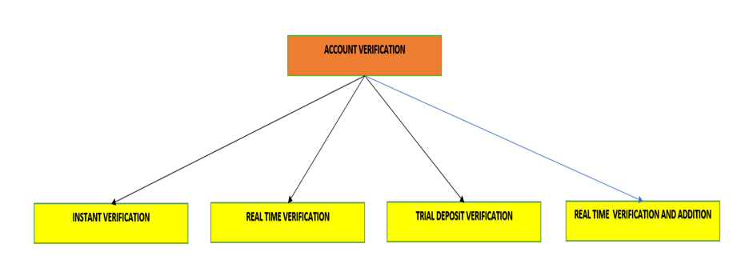

# Account Verification

TransferNow verifies a user’s ownership of an external account using four types of account verification:   

<ul>
<li>Instant</li>
<li>Real-time</li>
<li>Trial-deposit</li>
<li>Real Time Verification and Addition</li>
</ul>

 &nbsp;

<!-- theme: info -->

> :memo: **Note:** Clients have the option to allow Outbound Transfers (Transfer to a third-party account) to unverified external accounts, subject to a client-specified dollar limit. By default, verification is ON.

 &nbsp;

  
Account Verification

