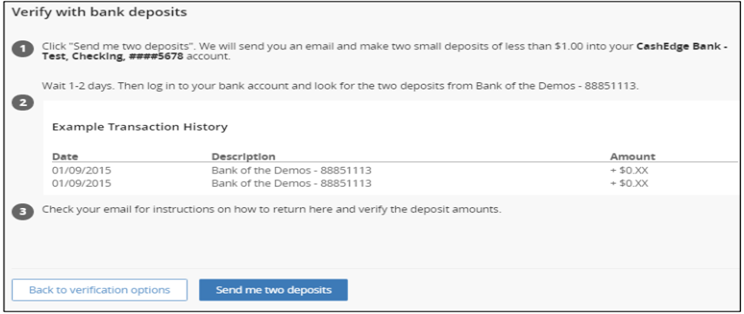
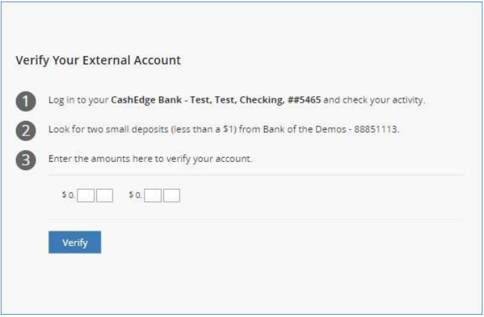

## Trial Deposit Verification

Using trial-deposit verification, TransferNow verifies account ownership by verifying the user's accessibility to the external account.

 

__Step-by-step instructions to verify and activate account using Trial Deposit:__

TN makes two small trial deposits and one trial debit (the debit is equal to the sum of the two deposits) to the external account and instructs the user to look for the two deposit amounts and enter the amounts on the application site.

    <ul>
        <li>
        Click “Send me two deposits” option, once the verification screen is directed to the Trial Deposit window.
        </li>
        <li> 
        On Day 0, Fiserv makes the two trial deposits and the trial debit to the external account via ACH
        </li>
        <li> 
        On Day 1, Fiserv receives confirmation that the trial deposits/debit were made. Fiserv sends an email to notify the user to look for the deposit amounts in the external account and return to the application to enter them
        </li>
        <li>
        On Day 2, the user returns to the application and enters the deposit amounts in the “Verify Your External Account” screen and click “Verify”.
        </li>
        <li>
        If the amounts reported by the user match the TransferNow deposits, then the user’s account ownership is verified.
        </li>
    </ul>

 &nbsp;

<!-- theme: info -->

>:memo:_**Note:** For brokerage accounts, two deposits and one debit (as applicable for some brokerages) will be sent for trial deposit verification._ 

<!-- theme: info -->

>:memo:_**Note:** The account cannot be verified if the trial deposit fails._

 &nbsp;

Following actions will take place when a trial deposit is failed:

    <ul>
        <li>
        When a trial deposit fails, Fiserv sends an email to the user informing them that account ownership cannot be verified
        </li>
        <li>
        The user can remove the account and add it one more time
        </li>
        <li>
        Fiserv will attempt another set of trial deposits and the user will have two more tries to verify them
        </li>
        <li>
        If the second attempt at account verification fails, the user cannot add the account to TransferNow services.
        </li>
    </ul>

&nbsp;

  
VERIFY WITH BANK DEPOSITS

     

&nbsp;

  
ACTIVATING ACCOUNT USING TRIAL DEPOSITS SCREEN

&nbsp;

[Click here](https://qa-developerstudio.fiserv.com/product/VerifyNow?branch=develop) to know more about account verification and access VerifyNow APIs

&nbsp;

## See Also
[Adding an Account](?path=docs/acc-to-acc-transfer/adding-Acc.md) 
[Add Restrictions](?path=docs/acc-to-acc-transfer/Manage-Account/acc-restrictions.md) 
[Account Summary Information](?path=docs/acc-to-acc-transfer/Manage-Account/acc-summary.md) 
[Add/Delete Limitations](?path=docs/acc-to-acc-transfer/Manage-Account/add-del-limitations.md) 
[Instant Verification](?path=docs/acc-to-acc-transfer/Account-Verify/Instant-Verify.md) 
[Real Time Verification](?path=docs/acc-to-acc-transfer/Account-Verify/real-time.md)

