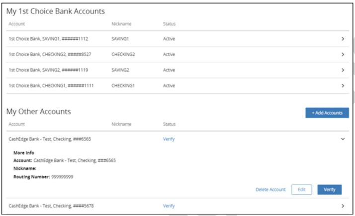

## Deleting Accounts 

<ul>
<li>From the Preferences screen, the user can choose Delete Account.</li>
<li>Select any account that you wanted to delete from the list.</li>
<li>Click “Delete Account”.</li>
<li>The Delete Account screen prompts the user to confirm that they want to delete the account.</li>
</ul>

<!-- theme: info -->

> :memo: **Note:** Users can delete an account that is suspended; however, they cannot re-add the account until the suspension has been lifted.

  

DELETE AN ACCOUNT

## Pending Transfers 

An account with a pending transfer cannot be deleted. The user can either wait until all pending 
transfers have completed or cancel all pending transfers that have not been released to ACH before 
attempting to delete the account again. 

## See Also

[Deleting Accounts](?path=docs/acc-to-acc-transfer/delete-Acc.md)   
[Add Restrictions](?path=docs/acc-to-acc-transfer/Manage-Account/acc-restrictions.md)   
[Account Summary Information](?path=docs/acc-to-acc-transfer/Manage-Account/acc-summary.md)   
[Add/Delete Limitations](?path=docs/acc-to-acc-transfer/Manage-Account/add-del-limitations.md)   
[Instant Verification](?path=docs/acc-to-acc-transfer/Account-Verify/Instant-Verify.md)   
[Real Time Verification](?path=docs/fund-transfer/Account-Verify/real-time.md)   
[Trial Deposit Verification](?path=docs/acc-to-acc-transfer/Account-Verify/trial-verify.md)   

