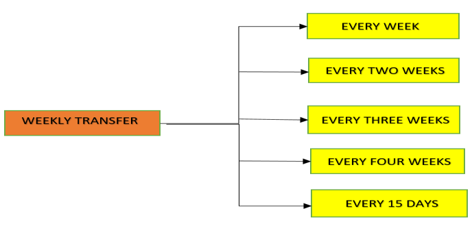
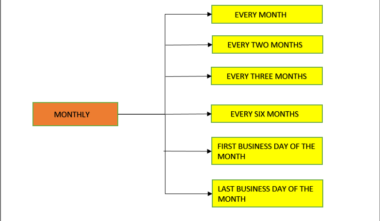
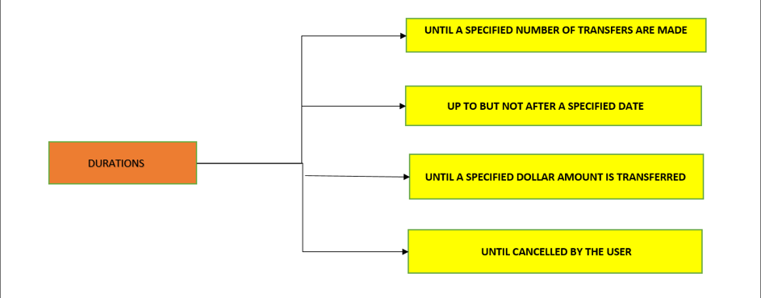

## Fund Transfer Frequencies and Duration

TransferNow supports the weekly and monthly frequencies. The details are shown below in Figures.

  
WEEKLY TRANSFER FREQUENCIES

  
MONTHLY TRANSFER FREQUENCIES

Fund Transfer durations are shown below in Figure.

  
FUND TRANSFER DURATIONS

## Documents References

[Transfer Methods](?path=docs/fund-transfer/FT-freq.md)  
[Transfer Cut-off Times](?path=docs/fund-transfer/transfer-cutOff.md)