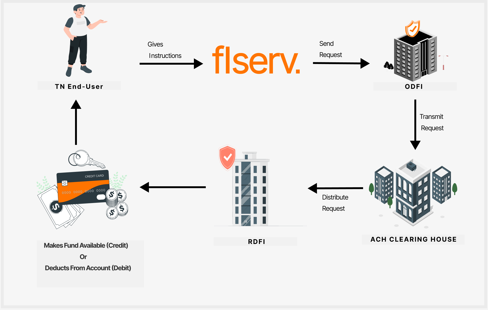

## Fund Transfer Services

After adding one or more accounts, the TransferNow user can set up one-time transfers and recurring transfers to move funds to and from the account(s). 

Users can create one-time and recurring transfers and can schedule them for standard (three day) or next-day delivery. Users can also create one-time transfers for instant delivery through use of real-time connectivity offered by the NOW Network.

Users can edit transfers that have not been sent to ACH.  

For account transfers, TN uses the Automated Clearing House (ACH) network to process electronic transactions.  

    <ul>
    <li>TN can process transfers returned for reasons such as non-sufficient funds and invalid account numbers.</li>
    <li>TN automatically suspends user accounts based on certain return transactions from ACH and can enforce suspensions on an account and user level.</li>
    </ul>

### ACH Processing

TN uses the Automated Clearing House (ACH) network to process electronic transactions. TN follows the standard ACH procedure: 

    <ul>
    <li>The TN end-user initiates the process by providing instructions for an electronic transaction.</li>
    <li>TN sends all transaction instructions in a batch file to an Originating Depository Financial Institution (ODFI).</li>
    <li>The ODFI forwards the information to the ACH operator.</li>
    <li>Finally, the ACH Operator sends the information to the Receiving Depository Financial Institution (RDFI).</li>
    </ul>

A complete money transfer comprises two transactions: a debit transaction to withdraw money from the source account and a credit transaction to deposit money into the destination account. The transfer is complete when both transactions have processed successfully. When an RDFI cannot process a transaction, due to various reasons, the RDFI issues a return to the ODFI.

TN supports two ACH transaction methods:

    <ul>
    <li>Good Funds Model (GFM)</li>
    <li>Next Day Transfers (NDT)</li>
    </ul>

A transaction processed via the GFM has less risk associated with it, because TN waits until the debit transaction completes successfully before initiating the credit transaction. On the other hand, for a NDT transaction, TN initiates both the credit and the debit transaction at the same time.

<!-- theme: info -->

> :memo: **Note:** Users can delete an account that is suspended; however, they cannot re-add the account until the suspension has been lifted.

<!-- 

<h1>One-Time Transfer</h1>

A one-time transfer requires the following information.

 -->

    <input type="checkbox" class="collapsible-checkbox" id="section1">
    <label class="label-expand" for="section1">One-Time Transfer</label>
    

        

            A one-time transfer requires the following information.
        

        
        <h2>Recurring Transfers</h2>
        

            Recurring transfers require the following information.
        

        
Note: The Instant Transfer option is not applicable for recurring transfers.

        
        <h2>On-Screen User Messaging</h2>
        
If a user sets up a Scheduled Recurring Transfer with a transfer date that falls on a weekend or a holiday, they are informed that:
 
        
“A send date of one or more transfers may fall on a weekend, bank holiday or at the end of a month with less than 31 days. We will reschedule these transfers for the business day”. 
        

        
Note: The previous/next day transfer will be adjusted based on the Financial Institutions choice to prepone or postpone transfers.

         
        
If a user attempts to schedule a one-time transfer on a weekend or holiday, the user is informed as follows: 

        
<strong>Weekend transfer:</strong> As the date selected is a weekend, this transfer will start to be processed on the next/prior business day.

        
<strong>Holiday transfer:</strong> As the date selected is a holiday, this transfer will start to be processed on the next/prior business day.

        
Note: The previous/next day transfer will be adjusted based on the Financial Institutions choice to prepone or postpone transfers.

    

    

     
    

    <input type="checkbox" class="collapsible-checkbox" id="section2">
    <label class="label-expand" for="section2">Standard Transfers</label>
    

        
Standard funds transfers are inter-institution transfers settled using the ACH system and completed within three business days. The completion of a transfer, including the availability of funds in the destination account and access to transaction details, depends in part on how quickly the client updates its account after receiving funds transfer information.
 
        
Funds are posted to the destination account before start-of-business on the third business day after the funds are withdrawn from the source account.

        
Banking holidays and/or New York Stock Exchange (NYSE) holidays extend the transaction cycle for standard transactions.

        <table>
  <tr>
    <th>Requested by 10:00 PST on:</th>
    <th>Source account debited before Start-of-Business on:</th>
    <th>Destination account credited before Start-of-Business on:</th>
  </tr>
  <tr>
    <td>Monday</td>
    <td>Tuesday</td>
    <td>Thursday</td>
  </tr>
  <tr>
    <td>Tuesday</td>
    <td>Wednesday</td>
    <td>Friday</td>
  </tr>
  <tr>
    <td>Wednesday</td>
    <td>Thursday</td>
    <td>Monday</td>
  </tr>
  <tr>
    <td>Thursday</td>
    <td>Friday</td>
    <td>Tuesday</td>
  </tr>
  <tr>
    <td>Saturday</td>
    <td>Monday</td>
    <td>Wednesday</td>
  </tr>
  <tr>
    <td>Sunday</td>
    <td>Monday</td>
    <td>Wednesday</td>
  </tr>
</table>
<h2>Available Balance Check</h2>
        
For an outbound one-time immediate transfer, TransferNow performs a check to determine if the amount of the transfer is greater than the host from-account’s available balance. The host account balance is passed from the client to Fiserv in the Single Sign-On.

        
TransferNow can perform either a hard fail or soft fail of the transfer if the available balance is less than the transfer amount.

        
Note: Clients specify whether they want hard fail or soft fail in the Data Gathering Form (DGF).

        
<strong>Hard Fail:</strong> As the date selected is a weekend, this transfer will start to be processed on the next/prior business day.

        
<strong>Soft Fail:</strong> As the date selected is a holiday, this transfer will start to be processed on the next/prior business day.

    

    

     
    

    <input type="checkbox" class="collapsible-checkbox" id="section3">
    <label class="label-expand" for="section3">Next Day Transfers</label>
    

        
Next-day ACH transfers are inter-institutional transfers in which both the debit and credit leg of the transaction settle the next business day by ACH.
 
        
The completion of a transfer, including the availability of funds in the destination account and access to transaction details, depends in part on how quickly the client updates his/her account after receiving funds transfer information.

        <table>
  <tr>
    <th>Requested by 10:00 PST on:</th>
    <th>Source account debited before Start-of-Business on:</th>
    <th>Destination account credited before Start-of-Business on:</th>
  </tr>
  <tr>
    <td>Monday</td>
    <td>Tuesday</td>
    <td>Tuesday</td>
  </tr>
  <tr>
    <td>Tuesday</td>
    <td>Wednesday</td>
    <td>Wednesday</td>
  </tr>
  <tr>
    <td>Wednesday</td>
    <td>Thursday</td>
    <td>Thursday</td>
  </tr>
  <tr>
    <td>Friday</td>
    <td>Monday</td>
    <td>Monday</td>
  </tr>
  <tr>
    <td>Saturday</td>
    <td>Tuesday</td>
    <td>Tuesday</td>
  </tr>
  <tr>
    <td>Sunday</td>
    <td>Tuesday</td>
    <td>Tuesday</td>
  </tr>
</table>
        
Accounts must qualify for Next-Day transfer service. If an account does not qualify for Next-Day, the Next-Day option is not made available to the user.

        
Next-Day service is an optional service. If a client chooses not to offer Next-Day, the Next Day does not appear in the user interface.

        <h2>Qualification Rules for Next-Day Transfers</h2>
        

            <ul>
            <li>The user has been a customer in good standing for at least three months.</li>
            <li>The user has not caused any negative activity or result via Fiserv ePayments software where such negative activity or result includes but is not limited to: Non-Sufficient Funds (NSF); Account Closed; Authorization Revoked by End User Payment Stopped; End User Advises Not Authorized; Account Holder deceased; Beneficiary Deceased; or Account Frozen.</li>
            <li>For each external account from which a Next-Day processing funds transfer is initiated, the user has completed at least one (1) successful inbound funds transfer of at least $500 from the external account to a client hosted account no sooner than sixty (60) days prior to initiating the first inbound Next-Day processing funds transfer.</li>
            <li>For an inbound transaction, the user maintains an available account balance of at least $750 in the client-hosted account receiving the funds transfer.</li>
            <li>For an outbound transaction, the user maintains an available account balance of at least $750 (excluding the transaction amount) in the client-hosted account.</li>
            </ul>
        

        
Note: If a client chooses not to offer an optional transfer type, it does not appear in the user interface.

    

    

     
    

    <input type="checkbox" class="collapsible-checkbox" id="section4">
    <label class="label-expand" for="section4">Next Day Good Funds</label>
    

        

            <ul>
            <li>Next Day Good Funds are Next Day transfers where the sender's account is instantly (within seconds) debited after the user executes a Next Day transfer. The credit to the receiving institution, however, occurs the next day via ACH.</li>
            <li>Next Day Good Funds are available when an FI is participating in Fiserv's NOW network and the sending account is at this FI. Because the funds being transferred are taken out of the sending account immediately after the user executes the transaction, the funds are guaranteed and secured for the FI, virtually eliminating all credit risk, including NSF. </li>
            <li>FIs that use Next Day Good Funds will be able to offer Next Day to 100% of its customers, increase limits, and reduce administrative costs.</li>
            </ul>
        

        

            The below Figure explains the differences in process flow between ACH, Next Day Good Funds, and Instant Transfers.
        

    

    

     

