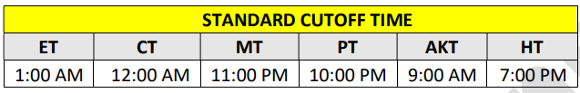

# Transfer Cut-off times 
&nbsp;

For each client, Fiserv sets the appropriate time zone for the Standard cutoff time and for the Next-Day 
cutoff time (for those clients who offer Next-Day transfer service). Clients may alter the time zone 
settings via the DGF. 

&nbsp;

  

&nbsp;

:memo: **Note:** If a client has specified the ET time zone for display of the Standard cutoff time, TransferNow 
includes an asterisk and a footnote on the screen, as shown below: 
&nbsp;

- An asterisk is displayed next to the Standard cutoff time. (i.e., 1 AM ET*) 
- A footnote is displayed at the base of the screen. 

:memo: **Note:** There are no cutoff times for Instant Transfers, as Instant Transfers will leverage the NOW 
network. ACH cutoff times and limitations do not apply to Instant Transfers.

