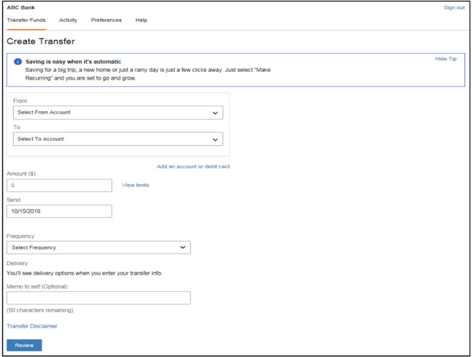

# Getting Started with Transfer Now

This document provides details on how TransferNow application enables a FI to offer secure inter-institution funds transfer services by automating the authentication of external accounts and debit cards, provides a comprehensive risk management system, and moves fund using the Automated Clearing House (ACH), and other payment networks. Common use cases include:

<ul>
<li>Add, verify, and delete external ACH accounts and debit cards (supported by Visa)</li>
<li>Create, edit, and cancel one-time scheduled and recurring transfers</li>
<li>View all transfer activity</li>
<li>Verify email addresses</li>
<li>View limits and fees</li>
<li>Validate limits</li>
</ul>

## SSL Log-In

An FI passes users to Fiserv via Secure Sockets Layer (SSL) Secure Messaging. SSL Secure Messaging is a specialized form of authentication that enables a user to authenticate once and gain access to the resources of multiple software systems.

When an FI passes users to Fiserv via SSL Secure Messaging, Fiserv routes them to the TN landing page, which is the Transfer Funds Overview screen.

  

TRANSFER NOW OVERVIEW SCREEN

Whenever Fiserv receives a user via SSL Secure Messaging, the user’s profile is registered in the Fiserv ePayments database. The profile establishes a unique identifier called <>.

<!-- theme: info -->

> :memo: **Note:** A unique TransferNow user is defined by last name, social security number, and date of birth. All users with matching information for these fields are considered the same user in TransferNow.

When a user is passed to Fiserv with an identifier that already exists in the Fiserv ePayments database, Fiserv treats them as a returning user. If the identifier does not exist, then Fiserv treats them as a new user, and registers the profile in the Fiserv ePayments database.

## Transfer Now Login

**Transfer Now can be deployed in one of the following ways:**

        

            <!--  -->
            

                
User Logging in via the Single Sign-On integration between Fiserv and the client partner (any Financial Institution) using the standard Fiserv ePayments user interface.

            

        

        

            <!--  -->
            

                
XML API integration with the respective Financial Institution web pages that support the service.

            

        

    

