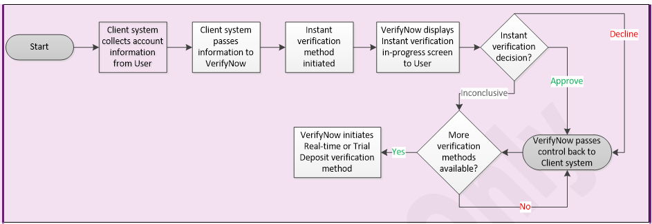
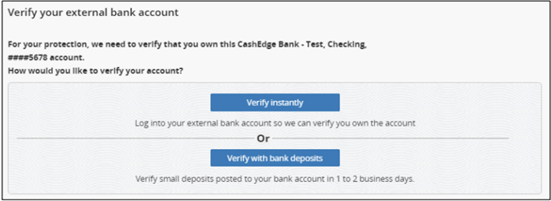
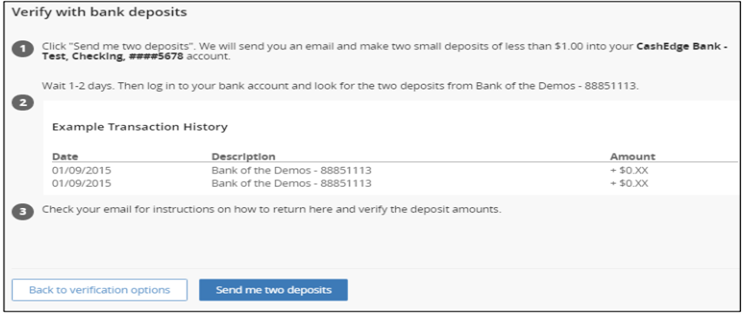
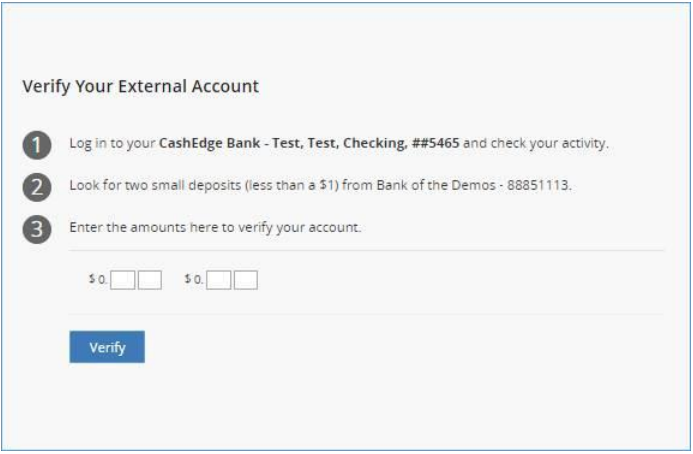

<!--
type: tab
titles: Instant Verification, RealTime Verification, Trail Deposite Verification, RealTime Verification Addition
-->

# Instant Verification

<!-- theme: info -->

> :memo: _**Note:** Instant account verification requires the financial institution client to have a contractual relationship established with Early Warning (EWS) for the Account Ownership Authentication service. Additional data sources will be added to the service in the future._

EWS houses data contributed by financial institutions with data elements including account holder names, address, tax ID, and additional elements leveraged to determine ownership of the account. Additionally, EWS provides a status of the account such as open/close, ability to accept debits, type of account, and risk indicators. Fiserv uses this response data to instantly decision the account as Approved, Denied, or Inconclusive. Inconclusive accounts are eligible for other verification methods.

Instant Verification process are as follows:

<ul>
<li>Once the user adds the account, TransferNow checks validates the ABA routing number in-session.</li>
<li>Once the user submits the routing and account number, TransferNow interacts with the EWS service and decisions the account.</li>
<li>If Approved, the Verification Complete screen is displayed, and the user can immediately begin initiating transfers to/from the account.</li>
<li>If Denied, the user is presented a message the account cannot be added and to try another account.</li>
<li>If the decision is Inconclusive, the user is directed either to real-time verification or trial deposit verification.</li>
</ul>

  
Account Verification

**Documents References**

[Account Restrictions](?path=docs/acc-to-acc-transfer/Manage-Account/acc-restrictions.md)
[Account Summary Information](?path=docs/acc-to-acc-transfer/Manage-Account/acc-summary.md)
[Deleting Accounts](?path=docs/acc-to-acc-transfer/delete-Acc.md)
[Pending Transfers](?path=docs/fund-transfer/pending-Transfer.md)
[Add/Delete Limitations](?path=docs/acc-to-acc-transfer/Manage-Account/add-del-limitations.md)

<!-- type: tab -->

# Real Time Verification

Real-time account verification - also known as “online credential verification” - leverages Fiserv Aggregation Services to perform the verification.

If an account is eligible for real-time account verification, TransferNow prompts the user to enter his/her user ID and password for the banking web site hosted by the financial institution that services the account. The AllData service allows TransferNow to log onto the web site. Once there, TransferNow adds the name and account numbers from the web site.

TransferNow then matches the added name and account numbers against the name of the applicant and the account number to verify account ownership in real time.

 &nbsp;

<!-- theme: info -->

> :memo: _**Note:** For security and privacy considerations, Fiserv never stores user ID and password data._

 &nbsp;

Real-time account verification can fail for the following reasons:

<ul>
<li>The user provided incorrect login credentials after multiple attempts</li>
<li>TransferNow was able to log onto the banking web site, but the information on the web site did not match what the user entered</li>
<li>The banking web site is down for upgrades or TransferNow is experiencing temporary connection issues with the web site.</li>
</ul>

 &nbsp;

If real-time account verification fails, the user is prompted to use the trial deposit verification method.

 &nbsp;

<!-- theme: info -->

> :memo: _**Note:** Clients can choose not to use real-time account verification to verify the user's ownership of the external account._

 &nbsp;

There are thousands of financial institutions. It is not possible for TransferNow to support real-time account verification for all institutions. TransferNow checks the ABA number of the external account to verify that it is a supported financial institution before offering real-time account verification as an option.

If real-time account verification is not available, then the user's account is verified using trial deposit verification.

Refer to account verification screen.

 &nbsp;

  
Account Verification

**Documents References**

- [Account Restrictions](?path=docs/acc-to-acc-transfer/Manage-Account/acc-restrictions.md)
- [Account Summary Information](?path=docs/acc-to-acc-transfer/Manage-Account/acc-summary.md)
- [Deleting Accounts](?path=docs/acc-to-acc-transfer/delete-Acc.md)
- [Pending Transfers](?path=docs/fund-transfer/pending-Transfer.md)
- [Add/Delete Limitations](?path=docs/acc-to-acc-transfer/Manage-Account/add-del-limitations.md)

<!-- type: tab -->

# Trial Deposit Verification

Using trial-deposit verification, TransferNow verifies account ownership by verifying the user's accessibility to the external account.

Step-by-step instructions to verify and activate account using Trial Deposit:

TN makes two small trial deposits and one trial debit (the debit is equal to the sum of the two deposits) to the external account and instructs the user to look for the two deposit amounts and enter the amounts on the application site.

<ul>
<li>Click “Send me two deposits” option as shown below in Figure 7, once the verification screen is directed to the Trial Deposit window</li>
<li>On Day 0, Fiserv makes the two trial deposits and the trial debit to the external account via ACH</li>
<li>On Day 1, Fiserv receives confirmation that the trial deposits/debit were made. Fiserv sends an email to notify the user to look for the deposit amounts in the external account and return to the application to enter them</li>
<li>If the amounts reported by the user match the TransferNow deposits, then the user’s account ownership is verified.</li>
</ul>

 &nbsp;

<!-- theme: info -->

> :memo: _**Note:** For brokerage accounts, two deposits and one debit (as applicable for some brokerages) will be sent for trial deposit verification._

<!-- theme: info -->

> :memo: _**Note:** The account cannot be verified if the trial deposit fails._

 &nbsp;

Following actions will take place when a trial deposit is failed:

<ul>
<li>When a trial deposit fails, Fiserv sends an email to the user informing them that account ownership cannot be verified</li>
<li>The user can remove the account and add it one more time</li>
<li>Fiserv will attempt another set of trial deposits and the user will have two more tries to verify them</li>
<li>If the second attempt at account verification fails, the user cannot add the account to TransferNow services.</li>
</ul>

Refer to account verification using Trial Deposit and activating the external account for transactions.

  
VERIFY WITH BANK DEPOSITS

               

  
ACTIVATING ACCOUNT USING TRIAL DEPOSITS SCREEN

---

## Documents References

[Account Restrictions](?path=docs/acc-to-acc-transfer/Manage-Account/acc-restrictions.md)
[Account Summary Information](?path=docs/acc-to-acc-transfer/Manage-Account/acc-summary.md)
[Deleting Accounts](?path=docs/acc-to-acc-transfer/delete-Acc.md)
[Pending Transfers](?path=docs/fund-transfer/pending-Transfer.md)
[Add/Delete Limitations](?path=docs/acc-to-acc-transfer/Manage-Account/add-del-limitations.md)

---

<!-- type: tab-end -->

