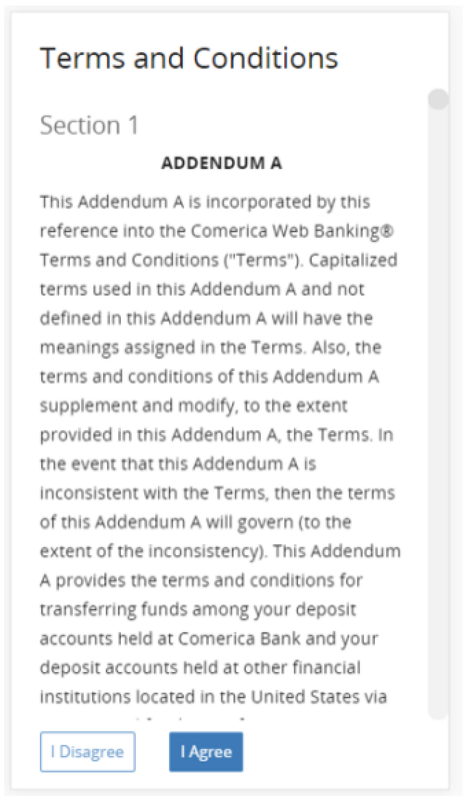

## First-Time Agreement Page Configuration

Each new end user accessing the service for the very first time will be presented with a First Time Agreement page, as shown in the following figure.

  
First-Time Agreement Page Configuration

The end user must agree to the terms and conditions detailed in the text of the agreement before being allowed access to the service. The language used in the agreement is always defined by the Client and the actual agreement text page itself can be hosted either on the Fiserv side or on the Client side. 
There are three configuration options available to the Client with regard to the behavior of user agreement acceptance:
-	Fiserv hosts the agreement page and tracks end user agreement acceptance 
-	Client hosts the agreement page and tracks end user agreement acceptance 
-	Fiserv configures a Client specified URL pointing to a Client hosted agreement page that contains only agreement text, and Fiserv tracks end user agreement acceptance.

<!-- theme: info -->

> :memo: **Note:** The Client preference for this option is to be indicated in the DGF.
Page Footer Configuration
Most Fiserv-hosted pages display a footer containing Client-defined URLs that link to the Client’s Terms of Service, Security Policy, and Privacy Policy. Each URL, when selected, will result in the content being displayed in a separate pop-up window. 
Also, content that each URL points to is hosted by the Client and not Fiserv, and if the Client does not define a URL for one of the footer links, then that link will not be displayed on any applicable Fiserv hosted page.

<!-- theme: info -->

> :memo: **Note:** The Client preference for this option is to be indicated in the DGF
