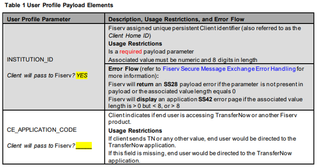

## Guidelines for Obtaining a CA Issued SSL Digital Server Certificate

Digital certificates can be purchased easily from any well-known CA; the following general guidelines should help the Client accomplish this task.

All well-known CAs allow a Client to apply for an SSL Digital Server Certificate online. Typically, this process begins with the Client filling out information about the company the certificate will be purchased for, contact information, and providing proof of valid company documentation (such as a company’s Articles of Incorporation).

The CA will also require that the Client provide a Certificate Signing Request (CSR). A CSR is a text file generated by a Client web server; it contains information about the organization. The CA will use the CSR to generate and validate certificates for the Client, and most web server vendors include support tools that can be used to generate this file. Below are some general guidelines for creating a CSR. Clients should review web server documentation specific to their server for the actual procedural steps needed to create a CSR.

- A CSR file can usually be named anything the Client chooses.
- The Client will typically be asked to enter a name for the key to be embedded in the certificate, and a corresponding private password. Take whatever steps are necessary to remember the password since it will be needed when the Client installs the CA issued certificate on a web server after the CA has sent back the certificate information.
- When creating the CSR, you’ll be asked to enter your company’s name and associated organizational information. You’ll also need to enter the Common Name (CN) of the certificate. Typically, the CN value entered is domain based—meaning if you wanted to secure the domain movefunds money.com, then you would enter that domain as the CN value.
- when requesting a certificate via a CA’s web site, the Client will be asked to submit the contents of the CSR file just created. The easiest way to do this is to open the CSR file as a text document, and then copy and paste the file data directly into the CA’s request form.

After a CA accepts the support documentation and CSR provided by the Client, the CA will then generate two digital certificates for the Client: a CA root certificate and the SSL Digital Server Certificate the Client (i.e., principal) has requested. The Client needs to install the server certificate on all web servers responsible for handling requests/response for the domain originally entered as the certificate CN value. The root certificate should be placed in each web server’s trusted root store (if not already there), and a copy should also be provided to Fiserv.
The actual installation of the server certificate is web server vendor dependent and, therefore, will vary. The usual generic install process usually resembles the following:

- Open your web server’s Key Manager.
- Find the key created as part of the CSR creation process and look for the option that allows you to install the associated key certificate.
- Select the file sent to the CA and, when prompted, enter the (private) password created as part of the CSR process.
- Follow all remaining instructions to the letter, and make sure to commit all changes when asked to do so.
                            
After the Client has installed the server certificate on all required web servers, SSL will need to be enabled for the domain the certificate was issued for. The way to do this is web server vendor specific, but most of the time it involves selecting the web site the Client wants to secure, accessing the web site’s security properties, and then selecting the option that will ensure that a secure channel is required when accessing this resource option is selected. 128-bit encryption should also be specified, as does the client certificate authentication method desired. Normally the Client would want to select the require client certificates option to ensure that only those servers providing the correct certificate will be granted access to the protected web site.

Client / Fiserv Payload Secure Message Exchange
Assume a Client’s end user has logged into the Client’s web page and now attempts to access the service via the Client’s TN page link. Before the Fiserv ePayments Client Integration Server can grant access to the requested service, it expects that the Client has included—as part of the access request— information specific to the end user only (i.e., account data, contact information, etc.). Upon receiving this end user payload information, the Fiserv ePayments Client Integration Server will check to ensure that all required information is part of the request; if the Fiserv ePayments Client Integration Server deems the payload as being valid, it will return an application session key back to the Client’s server. The Client will then use this session key as part of the end user redirect to the Fiserv ePayments Application Server, as shown in the following figure.

  

All exchange of payload and session key information done between the Client and Fiserv servers can be thought of as a Secure Message Exchange of data, since both the end user payload and the returned Fiserv generated session key happens over a pre-established SSL channel.

Client/Fiserv Secure Message Exchange Payload Parameters
The end user payload that a Client sends to Fiserv is composed of various parameter name/value pairs, transmitted to the Fiserv ePayments Client Integration Server in the form of an https POST (and NOT an https GET). Table 1 defines the User Profilepayload elements, Table 2 defines the Account Profile payload elements, and Table 3 defines the Card Account Profile payload elements that Fiserv processes as part of a Client payload secure message post. Each table provides a description of each payload element, any associated usage restrictions, and the error flow that either the service application takes or the Client should take if a payload issue is detected.

The business payload elements in Table 3 are only applicable if a Client has enabled Simple Business support in TN.

Payload elements that are listed as being a required payload parameter must be present in each and every Client submitted payload. In most cases, the absence of a required payload element or its associated allowed value will result in one of the following behaviors:
- The Fiserv server will return an SS error code which must be handled by the Client.
- Fiserv displays an application error page containing an SS error code to the end user (which does not need to be handled by the Client).
- Fiserv does not return any payload error code nor display an application error page if the parameter is not present in the payload. However, failure to pass the parameter or setting it to an unacceptable value could result in the associated account being displayed as suspended, thus making that account ineligible for transfers.
Payload elements that are listed (in Table 1 and Table 2) as being optional payload parameter but Fiserv strongly suggests Client include parameter and associated value for Risk Management purposes identify those elements where it is up to the Client to decide whether or not that respective element will be passed to Fiserv. Failing to pass such an element to Fiserv could have risk implications. For example, a Client choosing not to pass the user-in-good-standing payload element could result in Fiserv revisiting any risk agreement pre-negotiated with the Client under the assumption that all Risk Management payload elements would be passed to Fiserv. Additionally, the Client excluding any element identified as a Risk Management element could hinder Fiserv’s ability to detect end user fraud or service abuse.

  

  

  

  

  

  

  

  

  

  

  

  

  

