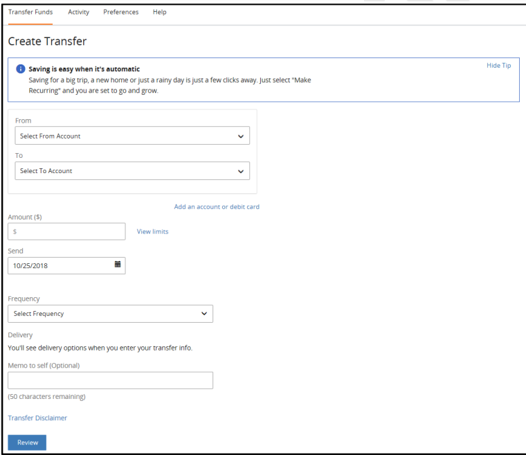
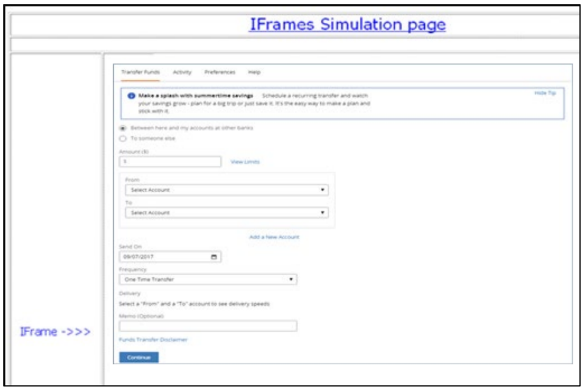
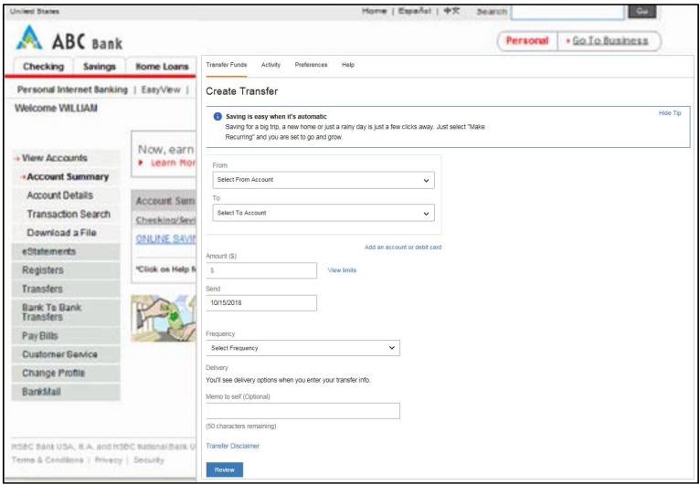

## TN Integration and Configuration Guide

TransferNow can be used as a standalone product, or integrated with other products.

<!-- theme: info -->

> _**Note:** A Client FI makes the service available to its existing customer base._

Clients choose to integrate the TransferNow service in one of the following ways:

<ul>
<li>Fiserv ePayments-hosted UI Solution: in this solution, Fiserv manages the entire online application experience.</li> 

<li>Client UI with API Solution: in this solution, the client has their own UI, and they integrate with TransferNow through XML or Web Services API’s.</li>
</ul>

&nbsp;

## Page Hosting Options

Fiserv provides the client with an HTML URL, which the client embeds into a hyperlink (or button) on their web site. When a user clicks on the hyperlink, the client “hands off” the user to Fiserv. From that point on, all the screens that the user sees are built and maintained by Fiserv per the client’s instructions in the DGF.

With the Fiserv ePayments-hosted UI solution, clients control how they launch the TransferNow service. They choose from the following types of implementations:

<ul>
<li>Full Control</li>
<li>Framed</li>
<li>Pop-up</li>
</ul>

&nbsp;

<!-- theme: info -->

> _**Note:** Almost all clients who choose the Fiserv ePayments-hosted UI solution opt for the full-control implementation._

## Full Control

A Client-initiated end user session will result in all respectiveFiserv-hosted web pages rendering within the same browser window initially used to display the Client web page. ThereforeHere, the user is directed to TransferNow screens that use the same window as the FI’s web page.

&nbsp;

  
FULL CONTROL IMPLEMENTATION

## Framed

A Client-initiated end user session will result in all respective Fiserv-hosted web pages rendering in a single frame embedded within the client’s parent web page. The Fiserv screens are embedded in a frame that is built and maintained by the client.

<!-- theme: info -->

> _**Note:** The size of this frame is controlled by the Client._

The navigation in the frame links only to screens within TransferNow. In this implementation, an FI has the option to remove the header and footer, so only the working area of the application is displayed in the frame. 
At the point of exit from TransferNow (which is running within a frame), the frame will disappear, and the full screen FI web page will be visible.

&nbsp;

  
FRAMED IMPLEMENTATION

## Pop-up

A Client-initiated end user session will result in all respective Fiserv-hosted web pages rendering within a second single browser pop-up window. when the user clicks on the Fiserv ePayments-provided HTML URL, a new window with the TransferNow application appears. Users work within the new window.

&nbsp;

  
POP-UP IMPLEMENTATION

The size of the browser pop-up window is controlled by the Client via code that gets added to the access link on the Client side. Below is an example of such code.

`<a href="#" onClick="popup=window.open(https://qa.fundstransfer.cashedge.com/signupGRel', 
'PopupPage', 'width=700, height=500, scrollbars=yes,resizable=yes,
toolbar=no, menubar=no'); return false;">Click to open</a>`

&nbsp;

<!-- theme: info -->

> _**Note:** If the Client chooses not to control the size of the pop-up browser window, then the default browser pop-up created will open in full screen mode which will most likely cover the client’s original parent window responsible for spawning the pop-up._

 

