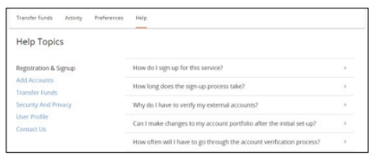

## Help Link Configuration

Fiserv-hosted TN pages contain an optional Help link that, when clicked, will display a Fiserv specific help page.

> :memo: _**Note:**The Client preference for this option is to be indicated in the DGF._