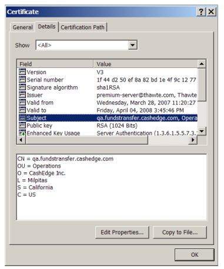
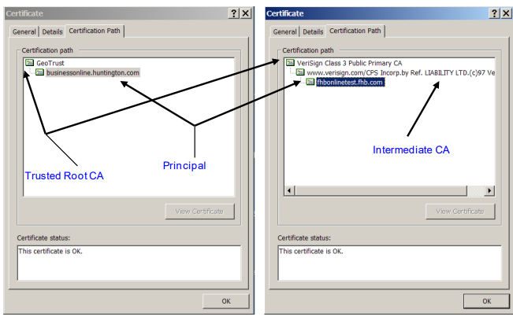

<!--

type: tab

titles: Zoning, SSL Transport Layer Security, Digital Certificates

-->

### Zoning

Zoning is the process of defining, grouping, and isolating different networked components into one of three zones (un-trusted, semi-trusted, and trusted) based on similar risks, trust levels, exposures or security needs. For example:

<ul>
<li>Any component that exists on a public network is considered to live in an un-trusted zone. A web browser with public internet access is considered to live in an un-trusted zone.</li>

<li>Any component that exists between an un-trusted zone and a trusted private network (such as a corporate intranet) is considered to live in a semi-trusted zone (also referred to as the demilitarized zone, or DMZ). Web servers, email servers, and ftp servers are all examples of components that typically live in a semi-trusted zone.</li>

<li>Any component that exists on a corporate private intranet is considered to live in a trusted zone. Typically, a company will have many servers, databases or other components that are only accessible via the corporation’s private internal network.</li>
<ul>

&nbsp;

In order for different zoned components to be able to communicate with each other, some components must first execute a series of zone-specific authentication requirements that mutually prove each component’s identity. In the case of the TN service, such authentication begins with the establishment of Secure Socket Layer Handshake between the Client Server and the Fiserv Server.

<!-- type: tab -->

### SSL Transport Layer Security

Secure Socket Layer (SSL) is the most commonly used secure transport protocol over the internet. It provides an effective means of maintaining transaction confidentiality when performing client-to-server communication and is supported by all of the major browsers and web application containers (i.e., web servers).

SSL always begins with a handshake, which is a series of steps that both the client and server must successfully execute before sensitive application-level data can be exchanged. An SSL handshake requires two round trips between the client and server.

The first round trip is used to trade information about what versions of the SSL protocol and cryptographic algorithms each supports, and to exchange some random values needed to compute a mutually agreed upon master secret that will be used to prove the freshness of the handshake.

The second round trip is when the client authenticates the server only, called One-way Sever Authentication, or the client authenticates the server and the server then authenticates the client, called Mutual Server Authentication.

Both roundtrips completing successfully results in an SSL channel being established between the client and server; application data is then allowed to flow between the client and server using this secure conduit.

<!-- type: tab -->

### Digital Certificates

Successful One-Way and Mutual Server Authentication is dependent upon the use of digital certificates. A digital certificate is a credential issued by a trusted authority that binds a principal (e.g., Fiserv or some Client) to an identity that can be recognized and verified. The most notable fields in a digital certificate structure are as follows:

<b>Subject</b> - the name of the principal that the certificate was issued to.

<b>Issuer</b> - the name of the organization that issued the certificate (typically the CA).

<b>Public Key</b> - the principal’s public key.

<b>Signature Algorithm</b> - the algorithm used to produce the certificate’s digital signature.

<b>Valid From/To</b> - when the validity of the certificate will expire.

A digital certificate contains the principal’s public key. If you were to sign a digital document with your own personal private key, you would need to provide the recipient of that document with your public key so that the recipient could verify that the document was really signed by you (that is, verify your digital signature).

Of course, how does the recipient of your document know that the public key you provided actually came from you? The answer is have your document also signed by a well-known issuing authority.

A root certificate is the digital certificate of an issuing authority—commonly referred to as a Certificate Authority (CA). A CA’s digital signature is present in all certificates that it signs on behalf of some principal. The root certificate is used to verify the integrity of any principal’s certificate, as issued by the CA. A CA signed certificate essentially means that the CA is vouching for the identity of the principal as described in the certificate (Subject), and that recipients of the principal’s certificate can trust the principal’s public key contained within the certificate.

The figure that follows shows how a digital certificate is represented in the Windows XP environment. Notice in the figure that the certificate was issued to qa.fundstransfer.cashedge.com (Subject) by Thawte (Issuer), and that the certificate is valid up until April 4, 2008 (Valid to). In order to verify the validity of the public key contained within this certificate, the recipient of this certificate would need use the issuer’s root certificate (which is typically pre-stored in a web server’s or browser’s Trusted Root Store) to verify the CA’s signature used to sign this certificate.

&nbsp;

&nbsp;

Validation of a principal’s certificate includes checking the subject value and the certificate path. A certificate path is the chain of certificates starting with a certificate issued by the CA root certificate and ending with the target certificate that needs to be validated. The certificate length is the

maximum depth of the certificate hierarchy to validate a certificate from the trusted root CA certificate to the principal’s certificate that needs to be validated.

The figures that follow show examples of two different SSL certificates. The certificate on the left was issued to principal businessonline.huntington.com, and the certificate on the right was issued to principal fhbonlinetest.fhb.com.

GeoTrust is the signing CA for the businessonline.huntington.com certificate, and Verisign is the signing CA for the fhbonlinetest.fhb.com certificate. Additionally, the GeoTrust signed certificate has a certificate length of 2, and the Verisign signed certificate has a certificate length of 3.

&nbsp;

&nbsp;

Why the difference in certificate lengths? Verisign uses an intermediate certificate to sign a certificate issued to some principal. An intermediate certificate is a subordinate certificate issued by the trusted root specifically used to issue SSL server certificates. The result is a chain that begins at the trusted root CA, runs through the intermediate and ends with the SSL certificate issued to the principal. Such certificates are called chained root certificates. The usage of an intermediate certificate thus provides an added level of security as the CA does not need to issue certificates directly from the CA root certificate.

<!-- type: tab-end -->