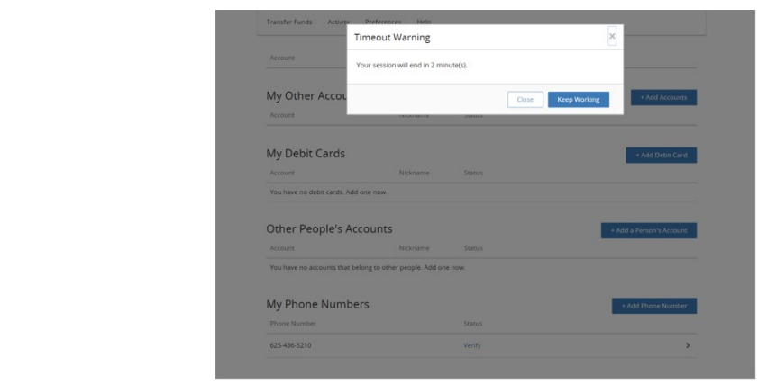

## Session Timeout Configuration

Session Timeout ConfigurationNo matter which page integration implementation the Client selects, Client consideration also needs to be given as to how to handle the possibility of an end user’s session timing out on the Fiserv side. Assume, for example, that an end user logs into the Client’s web site and then immediately accesses the service. Now assume the end user walks away from his or her computer for some period of time. Eventually, the end user’s session will timeout on the Fiserv side, the Client’s side—or both.

With Full Control or Framed implementations, an end user session timeout on the Fiserv side will result in the browser redirecting the end user to a Client specified URL initially passed to Fiserv by the Client as part of an end user payload post. For the Pop-Up implementation, Fiserv first informs the end user, via a dialog box (see the figure that follows), that their session has expired on the Fiserv side and after the end user clicks OK, the dialog box closes and the pop-up window would then redirect to the Client specified URL.

&nbsp;

  

&nbsp;

The Client specified return URL is passed in as part of each end user’s payload post; Failure to pass a return URL in the end user’s payload will result in the end user being redirected to the Client’s specified Logout URL.
&nbsp;

Finally, Fiserv suggests that the Client configure a session timeout expiration period to be less than that used as the session timeout period on the client’s side.
&nbsp;

> :memo: _**Note:** The Client preference for this option is to be indicated in the DGF._

&nbsp;

### See Also

[TN Integeration and Configuration Guide](?path=docs/getting-started/TN-INT-CONFIG/TN-Int-Config-Guide.md)

[First-Time Agreement Page Configuration](?path=docs/getting-started/TN-INT-CONFIG/First-Time-Page-Config.md)

[Help Link Configuration](?path=docs/getting-started/TN-INT-CONFIG/Help-Link-Config.md)

[Session Keep-Alive Configuration](?path=docs/getting-started/TN-INT-CONFIG/Session-keep-alive-config.md)

[Security Integration and Configuration Options](?path=docs/getting-started/TN-INT-CONFIG/Security-Int-Config.md)

[Fiserv Supported Modes of Server Authentication](?path=docs/getting-started/TN-INT-CONFIG/server-auth.md)

[Guidelines for Obtaining a CA Issued SSL Digital Server Certificate](?path=docs/getting-started/TN-INT-CONFIG/Guidelines-Obtain.md)

[Client / Fiserv Payload Secure Message Exchange](?path=docs/getting-started/TN-INT-CONFIG/client-payload.md)

[Fiserv Secure Message Exchange Error Handling](?path=docs/getting-started/TN-INT-CONFIG/message-error-handling.md)

[Fiserv Payload Submission Error Codes](?path=docs/getting-started/TN-INT-CONFIG/payload-sub-error.md)

[Fiserv ePayments TN Application Error Codes](?path=docs/getting-started/TN-INT-CONFIG/epayment-TN-error-code.md)

[Fiserv ePayments Secure Message Exchange QA and Production Environments](?path=docs/getting-started/TN-INT-CONFIG/epayment-QA-prod.md)

