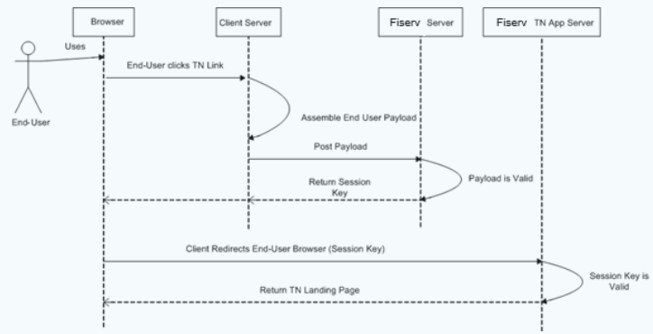

## Client / Fiserv Payload Secure Message Exchange

Assume a Client’s end user has logged into the Client’s web page and now attempts to access the service via the Client’s TN page link. Before the Fiserv ePayments Client Integration Server can grant access to the requested service, it expects that the Client has included—as part of the access request— information specific to the end user only (i.e., account data, contact information, etc.). 

Upon receiving this end user payload information, the Fiserv ePayments Client Integration Server will check to ensure that all required information is part of the request; if the Fiserv ePayments Client Integration Server deems the payload as being valid, it will return an application session key back to the Client’s server. The Client will then use this session key as part of the end user redirect to the Fiserv ePayments Application Server.

All exchange of payload and session key information done between the Client and Fiserv servers can be thought of as a Secure Message Exchange of data, since both the end user payload and the returned Fiserv generated session key happens over a pre-established SSL channel.

## Client/Fiserv Secure Message Exchange Payload Parameters

The end user payload that a Client sends to Fiserv is composed of various parameter name/value pairs, transmitted to the Fiserv ePayments Client Integration Server in the form of an https POST (and NOT an https GET). Table 1 defines the User Profilepayload elements, Table 2 defines the Account Profile payload elements, and Table 3 defines the Card Account Profile payload elements that Fiserv processes as part of a Client payload secure message post. Each table provides a description of each payload element, any associated usage restrictions, and the error flow that either the service application takes or the Client should take if a payload issue is detected.

The business payload elements in Table 3 are only applicable if a Client has enabled Simple Business support in TN.

Payload elements that are listed as being a required payload parameter must be present in each and every Client submitted payload. In most cases, the absence of a required payload element or its associated allowed value will result in one of the following behaviors:

<ul>
<li>The Fiserv server will return an SS error code which must be handled by the Client.</li>

<li>Fiserv displays an application error page containing an SS error code to the end user (which does not need to be handled by the Client).</li>

<li>Fiserv does not return any payload error code nor display an application error page if the parameter is not present in the payload. However, failure to pass the parameter or setting it to an unacceptable value could result in the associated account being displayed as suspended, thus making that account ineligible for transfers.</li>

Payload elements that are listed (in Table 1 and Table 2) as being optional payload parameter but Fiserv strongly suggests Client include parameter and associated value for Risk Management purposes identify those elements where it is up to the Client to decide whether or not that respective element will be passed to Fiserv. Failing to pass such an element to Fiserv could have risk implications. For example, a Client choosing not to pass the user-in-good-standing payload element could result in Fiserv revisiting any risk agreement pre-negotiated with the Client under the assumption that all Risk Management payload elements would be passed to Fiserv. Additionally, the Client excluding any element identified as a Risk Management element could hinder Fiserv’s ability to detect end user fraud or service abuse.

<!--table add>