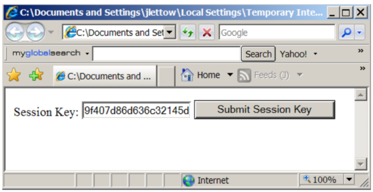

## Fiserv ePayments Secure Message Exchange QA and Production Environments

Client/Fiserv Payload Secure Message Exchange describes, in detail, the payload parameters that the Client must send to Fiserv before end user access to the service is granted. Additionally, the same section also details the possible errors that may arise, as well as how the Client should handle such errors if the payload secure message exchange between Fiserv and the Client should fail.

Clients are required to submit end user payloads to the Fiserv Client Integration Server via one of URLs listed in Table 6. The QA URLs are to be used by Clients wishing to test the service in the Fiserv ePayments QA environment, and the Production URLs would be used when the Client’s implementation has been deployed to the Fiserv ePayments production environment.

The payload submission URLs in Table 6 are not shown in their entirety; what’s missing from the URL is, of course, the Client end user submitted payload—which would get appended to the end of each respective URL (thus replacing the substring) just after the question mark (‘?’)

Client/Fiserv Payload Secure Message Exchange also explains that, upon receiving this end user payload information, the Fiserv Client Integration Server will check to ensure that all required information is part of the request. If the Fiserv Client Integration Server deems the payload as being valid, it will return an application session key back to the Client’s server; otherwise it will return an SS error code (see Fiserv Payload Submission Error Codes).

An example of a valid session key is shown below. Note that the value for all valid session keys returned in the Fiserv Client Integration Server response are preceded with a ‘0’, followed by two pipe characters (“||”). Shown in the figure that follows, the actual session key value that the Client would use when performing an end user redirect to the Fiserv TN Application Server, is the complete string value that follows the two pipe characters (i.e., 1180141 . . .).

After the Client captures the session key value returned in the response from the Fiserv Client Integration Server, the Client would then append this value to one of the session key submission URLs shown in Table 7, just after the KEY= string (thus replacing the substring) shown in the URL. Note that each URL shown in Table 7 contains a substring; this substring needs to be replaced by the Fiserv assigned home ID servlet, which is unique to each Client before the Client can successfully redirect the end user’s browser to that URL.

Client Decision: Payload Session Key Expiration Period

When the Fiserv Client Integration Server returns a session key in response to a Client submitted end user payload, the key is only valid for a short period of time and, therefore, must be submitted to one of the key submission URLs listed in Table 7 before the session key validation period expires. (If the Client performs the redirect after the session key has expired, the service will display an SS41 error page; see Fiserv ePayments TN Application Error Codes.)

The Client is requesting the following session key expiration period:

### How to Perform a Payload Submission Using only a Web Browser

Assume that the Client wishes to submit the payload parameters shown in the table below to the Fiserv TN service QA environment.

 

In reviewing Table 8 and comparing its contents with the contents of the User Profile Payload Elements and Account Profile Payload Elements tables (Table 1 and Table 2 respectively), you’ll notice that this particular payload contains all the required and some optional end user information, including account information for two different Client hosted accounts.

All of the text boxes contained within the form are read-only, so the displayed values cannot be changed. If you scroll down to the bottom of the page and click the Submit Payload button, the payload being displayed in the form will actually be sent to the Fiserv TN service demonstration servlet.

Moreover, after you click the Submit Payload button, a second browser window will open and display the session key returned from the Fiserv Client Integration Server. When the Submit Payload button is clicked, the payload shown in the example form gets submitted as an HTTPS payload POST via the URL below:

https://certsso.ft.cashedge.com/signupGRel?&INSTITUTION_ID=88850000&USER_FI_NUMBER=endUser12&FIRST_NAME=JOE&LAST_NAME=SMITH&EMAIL=jlettow@cashedge.com&STREET=180%20ELM%20COURT&CITY=SUNNYVALE&STATE=CA&ZIP=19705&SSN=123456789&DOB=02/23/1970&PHONE=9999999999&DRV_LIC=99999999&DRV_LIC_STATE=CA&USER_IN_GOOD_STANDING=1&LANGUAGE=ENGLISH&ANUM0=5345435&ASEG0=AA&ADSC0=HIGH%20INTEREST%20SAVINGS&ATYP0=0&ASTAT0=0&BALANCE0=193792.99&RTN0=272482391&ANUM1=5357780&ASEG1=BB&ADSC1=FREE%20CHECKING&ATYP1=1&ASTAT1=0&BALANCE1=10000.00&RTN1=272482391

#### Sample payload when business accounts are passed:

https://certsso.ft.cashedge.com/signupGRel?USER_FI_NUMBER=endUser12&&FIRST_NAME=JOE&MIDDLE_NAME=V&LAST_NAME=SMITH&DOB=02/23/1970&SSN=970565443EMAIL=bodBizSupport@cashedge.com&PHONE=34556546543&ZIP=19705&STREET=180%20ELM%20COURT&STREET2=&CITY=sunnyvale&STATE=CA&INSTITUTION_ID=88851116&DRV_LIC=44564565&DRV_LIC_STATE=CA&ANUM0=9936977&ATYP0=6&ASTAT0=0&ASEG0=&BALANCE0=116936.38&DATE_ACT_OPENED0=07/2014&ACCOUNT_NUMBER0=XXXX36977&RTN0=113024274&BUSINESS_NAME0=ABC%20INC.&BUSINESS_EMAIL0=CS@ABCtest.com&BUSINESS_PHONE0=2345678901&BUSINESS_STREET0=180%20ELM%20COURT&BUSINESS_STREET20=&BUSINESS_CITY0=Sunnyvale&BUSINESS_STATE0=CA&BUSINESS_ZIP0=94555&BUSINESS_EIN0=123456ADSC0=FREE%20BIZ%20CHECKING

With this in mind, now try the following. Open another browser window and copy the above URL, in its entirety, directly into your browser’s address bar and then press enter. The behavior you experience using this payload submission method should be exactly the same as when you clicked the Submit Payload button in the example payload submission form: A valid session key (with a different value) gets returned from the Fiserv Client Integration Server and is displayed in your browser window.

The actual returned session key value is preceded by a ‘0’ and two pipe characters (“||”). For illustrative purposes, the session key value shown previously has been reproduced below in bolded red text. Of course, as was previously stated, the session key value you see in your browser windows will be a different value than the one shown below because all generated session key values returned by the Fiserv Client Integration Server are guaranteed to be unique.

0||9f407d86d636c32145dd7f05062230ae

### How to Perform a Session Key Submission Using only a Web Browser

Performing a session key submission to the Fiserv Service Application Server happens only after a valid payload has been previously submitted to the Fiserv Client Integration Server and a resultant valid session key value has then been returned by this server, as previously described in How to Perform a Payload Submission Using only a Web Browser. What then, does the Client do with this session key value? This section describes how to simulate a Client initiated end user redirect using a web browser, the appropriate redirect URL, and the valid session key value.

Now copy the session key value returned to you as a result of performing the steps in How to Perform a Payload Submission Using only a Web Browser into the Session Key text box and click Submit Session Key.

When the Submit Session Key button is clicked, the session key value is being submitted to a URL. If the session key you submitted is verified as being valid, the end user will be logged into the Fiserv TN service demonstration application.

Alternatively, you can enter the URL directly into your browser’s address bar and then press enter.

https://certtransfers.fta.cashedge.com/popmmp/faces/loginServlet?INSTITUTION_ID=&KEY=9f407d86d636c32145dd7f05062230ae
