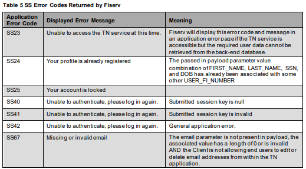

## Fiserv ePayments TN Application Error Codes

As stated in Client/Fiserv Secure Message Exchange Payload Parameters, the Fiserv ePayments Client Integration Server will display, to the end user, an application error page containing one or more SS error codes if an application error is thrown; an example is shown below.

Unlike the error codes listed in Fiserv Payload Submission Error Codes, application error codes do not require the Client to perform any additional error handling because an application error page will only be displayed after the end user has been granted access to the service.

<i class="fa fa-exclamation-triangle" aria-hidden="true"></i> SS24 Your Profile is already registered.

Table 5 lists all of the SS error codes that Fiserv will display in an application error page to the service end user. The Client does not need to perform additional error handling for any of the listed error codes.

