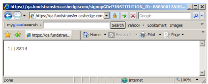
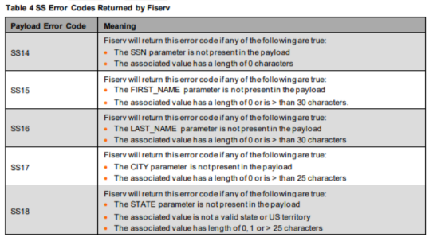
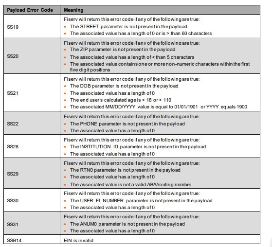

## Fiserv Payload Submission Error Codes

As stated in Client/Fiserv Secure Message Exchange Payload Parameters, the Fiserv ePayments Client Integration Server will return to the Client, one or more SS error codes in the https response if a problem with a Client submitted payload is detected. For example, as noted in Client/Fiserv Secure Message Exchange Payload Parameters, one of the required elements that must be submitted to Fiserv in the payload is the end user’s Social Security number. Failure to include this required name/value pair element in the payload would result in the Fiserv Client Integration Server returning an SS14 error code rather than a valid session key, as shown in the figure that follows.

The “1” preceding the two pipe characters (“||”) indicates that the payload submission failed, and the SS14 following the two pipe characters represents the SS error code. If the payload submission resulted in multiple error codes being returned in the response, then a comma delimited list of error codes, following the two pipe characters, would be returned.

Table 4 lists all of the SS error codes that Fiserv will return to the Client in the https response as a result of the Client submitting an invalid payload; the Client will need to perform the proper error handling for any of the listed returned errors.

 

