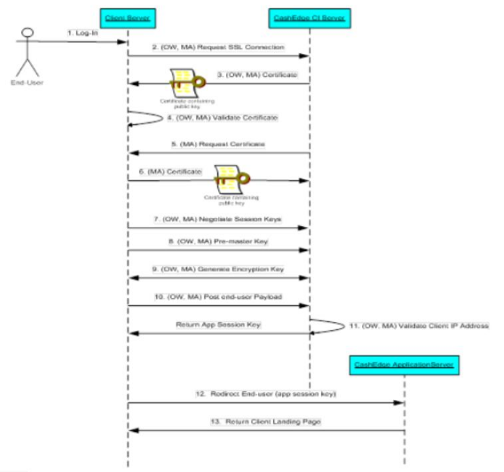

## Fiserv Supported Modes of Server Authentication

Fiserv takes a three-pronged approach to establishing a trust relationship between the Client Server and the Fiserv ePayments Client Integration Server:

<ul>
<li>Fiserv supports Mutual Server Certificate Authentication Only (also called Client Certificate Authentication). Fiserv uses Verisign, Thawte (www.thawte.com) and GeoTrust as its trusted Certificate Authority (CA), and all data passing through a client-server SSL connection is at least 128 bit encrypted.</li>

<li>Any access request must come from a Client Server whose IP addresses is contained in, and can be validated against, a Client supplied, server IP address list.</li>

<li>Fiserv trusts that the Client has pre-authenticated any end user accessing the service. This means that the Client is responsible for establishing the end user’s identity before that end user is allowed access to TN, and that all end user payload information passed from the Client’s Server to the Fiserv ePayments Client Integration Server is valid. More information regarding the secure message exchange of payload information can be found in Client/Fiserv Payload Secure Message Exchange.</li>
</ul>

The following figure shows the SSL steps taken for certificate authentication; (OW, MA) indicates that the step is required for both One-way Server and Mutual Server Authentication, and (MA) indicates that the step is required for Mutual Server Authentication only.

&nbsp;

The steps are as follows:

<ul>
<li>A Client trusted end user access the service via the Client’s web page.</li>

<li>(OW, MA) The Client Server requests an SSL connection to the Fiserv ePayments Client Integration (CI) Server.</li>

<li>(OW, MA) The Fiserv ePayments CI Server responds by sending its public key using a digital certificate previously signed by a trusted third-party certificate authority (CA).</li>

<li>(OW, MA) The Client Server checks the Fiserv ePayments CI Server’s certificate to determine whether or not the signing CA’s root certificate (containing the CA’s public key) is contained in its trusted root store. If the digital signature on the Fiserv ePayments CI Server's certificate matches the digital signature on one of the CA root certificates, then the Fiserv ePayments CI Server can be trusted.</li>

<li>(MA) The Fiserv ePayments CI Server now requests that the Client Server send its public key contained within its certificate.</li>

<li>(MA) The Fiserv ePayments CI Server checks Client Server’s certificate to determine whether or not the signing CA’s root certificate (containing the CA’s public key) is contained in its trusted root store. If the digital signature on the Client Server's certificate matches the digital signature on one of the root certificates, then the Client Server can be trusted.</li>

<li>(OW, MA) Session keys are securely negotiated between the Client Server and the Fiserv ePayments CI Server, the end result being that a secure and trusted communication channel has now been established between the servers.</li>

<li>(OW, MA) The Client’s Server generates a pre-master key which is encrypted with the Fiserv ePayments CI Server’s public key and then sends it back to the Fiserv ePayments CI Server.</li>

<li>(OW, MA) Both the Client Server and the Fiserv ePayments CI Server compute a master key and generate a secret symmetric key which will then be used to encrypt all messages between the two servers.</li>

<li>(OW, MA) The Client’s Server then posts the end user’s payload to the Fiserv ePayments CI server.</li>

<li>(OW, MA) The Fiserv ePayments CI Server validates the IP address of the Client’s Server and, if valid, saves the end user’s data on the Fiserv side. The Fiserv ePayments CI Server then generates a temporary application session key that it sends back to the Client’s Server.</li>

<li>The Client’s Server uses this temporary application session key as part of a URL redirect of the end user’s browser to the Fiserv ePayments Application Server. Failure of the Client to redirect the end user’s browser to the Fiserv ePayments Application Server within the transient application session key’s expiration time (typically 5 minutes) will result in the end user being presented with an error page.</li>

<li>The end user’s browser establishes an https session with the Fiserv ePayments Application Server. The Fiserv ePayments Application Server responds by sending back the Client’s TN landing page to the end user’s browser.</li>

