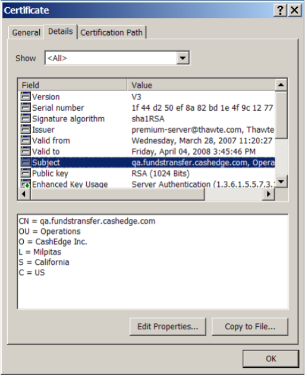
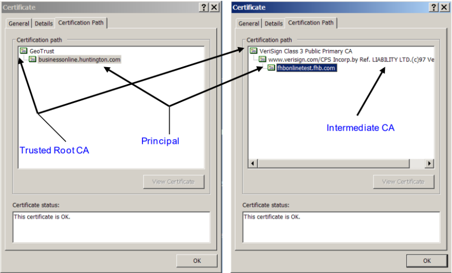

## Digital Cerificates 

Successful One-Way and Mutual Server Authentication is dependent upon the use of digital certificates. A digital certificate is a credential issued by a trusted authority that binds a principal (e.g., Fiserv or some Client) to an identity that can be recognized and verified. The most notable fields in a digital certificate structure are as follows: 
&nbsp;

<table class="digi-table">
<tr>
<td>
<b>Subject </b>
</td>
<td>
the name of the principal that the certificate was issued to
</td>
</tr>
<tr>
<td>
<b>Issuer </b>
</td>
<td>
the name of the organization that issued the certificate (typically the CA) 
<tr>
<td>
<b>Public Key </b>
</td>
<td>
the principal’s public key 
</td>
</tr>
</td>
</tr>
<tr>
<td>
<b>Signature Algorithm </b>
</td>
<td>
the algorithm used to produce the certificate’s digital signature
</td>
</tr>
<tr>
<td>
<b>Valid From/To </b>
</td>
<td>
when the validity of the certificate will expire
</td>
</tr>
</table>

A digital certificate contains the principal’s public key. If you were to sign a digital document with your own personal private key, you would need to provide the recipient of that document with your public key so that the recipient could verify that the document was really signed by you. 

A root certificate is the digital certificate of an issuing authority—commonly referred to as a Certificate Authority (CA). A CA’s digital signature is present in all certificates that it signs on behalf of some principal. The root certificate is used to verify the integrity of any principal’s certificate, as issued by the CA. A CA signed certificate essentially means that the CA is vouching for the identity of the principal as described in the certificate (Subject), and that recipients of the principal’s certificate can trust the principal’s public key contained within the certificate. 
&nbsp;

  

&nbsp;

Validation of a principal’s certificate includes checking the subject value and the certificate path. A certificate path is the chain of certificates starting with a certificate issued by the CA root certificate and ending with the target certificate that needs to be validated. The certificate length is the maximum depth of the certificate hierarchy to validate a certificate from the trusted root CA certificate to the principal’s certificate that needs to be validated. 

&nbsp;

  

&nbsp;

GeoTrust is the signing CA for the businessonline.huntington.com certificate, and Verisign is the signing CA for the fhbonlinetest.fhb.com certificate. Additionally, the GeoTrust signed certificate has a certificate length of 2, and the Verisign signed certificate has a certificate length of 3. 

<!-- theme: info -->

> :memo: 
_**Note:** Verisign uses an intermediate certificate to sign a certificate issued to some principal.  
An intermediate certificate is a subordinate certificate issued by the trusted root specifically used to issue SSL server certificates._

&nbsp;

Click here to know more about [Guidelines for Obtaining a CA Issued SSL Digital Server Certificate](?path=docs/getting-started/TN-Integration-Guide/SSL-Guidelines.md)

&nbsp;

     
    

        <a href="?path=docs/getting-started/TN-Integration-Guide/SSL-Authentication.md">Back</a>
    

    

        <a href="?path=docs/getting-started/TN-Integration-Guide/Server-Authentication.md">Next</a>
    

