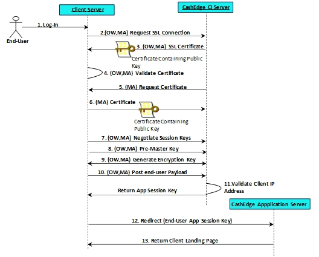

## SSL Authentication 

Secure Socket Layer (SSL) is the most used secure transport protocol over the internet. It provides an effective means of maintaining transaction confidentiality when performing client-to-server communication and is supported by all the major browsers and web servers. 

SSL always begins with a handshake, which is a series of steps that both the client and server must successfully execute before sensitive application-level data can be exchanged. An SSL handshake requires two round trips between the client and server. 

The first-round trip is used to trade information about what versions of the SSL protocol and cryptographic algorithms each supports, and to exchange some random values needed to compute a mutually agreed upon master secret that will be used to prove the freshness of the handshake.  

The second-round trip is when the client authenticates the server only, called One-way Sever Authentication, or the client authenticates the server and the server then authenticates the client, called Mutual Server Authentication.  

Both roundtrips completing successfully results in an SSL channel being established between the client and server; application data is then allowed to flow between the client and server using this secure conduit. 

The following figure shows the SSL steps taken for certificate authentication; (OW, MA) indicates that the step is required for both One-way Server and Mutual Server Authentication, and (MA) indicates that the step is required for Mutual Server Authentication only. 

&nbsp;
 
 

  
  

 
&nbsp;

An FI passes users to Fiserv via Secure Sockets Layer (SSL) Secure Messaging. Following steps help the user understand how an FI passes users to Fiserv via SSL Secure Messaging and routes them to the TN landing page, which is the Transfer Funds Overview screen. 

<ul>
<li>A Client trusted end user access the service via the Client’s web page.</li>

<li>(OW, MA) The Client Server requests an SSL connection to the Fiserv ePayments Client Integration (CI) Server.</li>

<li>(OW, MA) The Fiserv ePayments CI Server responds by sending its public key using a digital certificate previously signed by a trusted third-party certificate authority (CA).</li>

<li>(OW, MA) The Client Server checks the Fiserv ePayments CI Server’s certificate to determine whether the signing CA’s root certificate (containing the CA’s public key) is contained in its trusted root store. If the digital signature on the Fiserv ePayments CI Server's certificate matches the digital signature on one of the CA root certificates, then the Fiserv ePayments CI Server can be trusted. </li>

<li>(OW, MA) The Client Server checks the Fiserv ePayments CI Server’s certificate to determine whether the signing CA’s root certificate (containing the CA’s public key) is contained in its trusted root store. If the digital signature on the Fiserv ePayments CI Server's certificate matches the digital signature on one of the CA root certificates, then the Fiserv ePayments CI Server can be trusted.</li>

<li>(MA) The Fiserv ePayments CI Server now requests that the Client Server send its public key contained within its certificate.</li>

<li>(MA) The Fiserv ePayments CI Server checks Client Server’s certificate to determine whether the signing CA’s root certificate (containing the CA’s public key) is contained in its trusted root store. If the digital signature on the Client Server's certificate matches the digital signature on one of the root certificates, then the Client Server can be trusted. </li>

<li>(OW, MA) Session keys are securely negotiated between the Client Server and the Fiserv ePayments CI Server, the result being that a secure and trusted communication channel has now been established between the servers.</li>

<li>(OW, MA) The Client’s Server generates a pre-master key which is encrypted with the Fiserv ePayments CI Server’s public key and then sends it back to the Fiserv ePayments CI Server.</li>

<li>(OW, MA) Both the Client Server and the Fiserv ePayments CI Server compute a master key and generate a secret symmetric key which will then be used to encrypt all messages between the two servers.</li>

<li>(OW, MA) The Client’s Server then posts the end user’s payload to the Fiserv ePayments CI server.</li>

<li>(OW, MA) The Fiserv ePayments CI Server validates the IP address of the Client’s Server and, if valid, saves the end user’s data on the Fiserv side. The Fiserv ePayments CI Server then generates a temporary application session key that it sends back to the Client’s Server.</li>

<li>The Client’s Server uses this temporary application session key as part of a URL redirect of the end user’s browser to the Fiserv ePayments Application Server. Failure of the Client to redirect the end user’s browser to the Fiserv ePayments Application Server within the transient application session key’s expiration time (typically 5 minutes) will result in the end user being presented with an error page.</li>

<li>The end user’s browser establishes an https session with the Fiserv ePayments Application Server. The Fiserv ePayments Application Server responds by sending back the Client’s TN landing page to the end user’s browser.</li>

</ul>

 &nbsp;
 
 

  
  

 
&nbsp;

Whenever Fiserv receives a user via SSL Secure Messaging, the user’s profile is registered in the Fiserv ePayments database (See [AllData® Aggregation](https://qa-developerstudio.fiserv.com/product/AllDataAggregation?branch=develop) / [Instant (Risk Database) Verification](https://qa-developerstudio.fiserv.com/product/VerifyNow/docs/?path=docs/verify-accounts-using-verifynow/instant-verification.md&branch=develop)). The profile establishes a unique identifier called <>.

<!-- theme: info -->

> :memo: _**Note:** A unique TransferNow user is defined by last name, social security number, and date of birth. All users with matching information for these fields are considered the same user in TransferNow._

<!-- theme: info -->

> :memo: _**Note:** When a user is passed to Fiserv with an identifier that already exists in the Fiserv ePayments database, Fiserv treats them as a returning user (See [VerifyNow User WorkFlow](https://qa-developerstudio.fiserv.com/product/VerifyNow?branch=develop)). If the identifier does not exist, then Fiserv treats them as a new user (See [VerifyNow User WorkFlow](https://qa-developerstudio.fiserv.com/product/VerifyNow?branch=develop)) and registers the profile in the Fiserv ePayments database._

 

## See Also 

[Digital Certificates](?path=docs/getting-started/TN-Integration-Guide/Digital-Certificates.md)    
[Server Authentication](?path=docs/getting-started/TN-Integration-Guide/Server-Authentication.md)    

 

 

