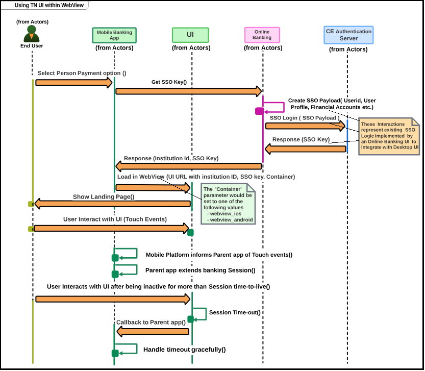

## SSO for Mobile

The below Figure represents the proposed sequence of calls via the SSO. See [SSO - Payload Secure Message Exchange](?path=docs/getting-started/TN-Integration-Guide/SSO-Guidelines/payload-secure-msg.md) to know more about the SSO process and the list of applicable SSO elements. 

&nbsp;
   

&nbsp;

<!-- <style>
.center {
  display: block;
  margin-left: auto;
  margin-right: auto;
  width:50%;
}
</style> -->

This leverages the TransferNow SSO built for online banking. The parent app will need to get that one-use SSO key from the existing middleware. The SSO key will then be appended to the URL to invoke TransferNow in the webview.  
URLs would be confirmed during the implementation, clients continue to invoke the existing TransferNow URL and would internally get directed to the TransferNow UI. 


&nbsp;

## Sample Pseudocode for Invoking WebView

**Android**

```

WebView loadView = (WebView)eSignDetailView.findViewById(R.id.);
loadView.getSettings().setJavaScriptEnabled(true);
loadView.setWebChromeClient(new WebChromeClient());
loadView.loadUrl(<>);

```

**iOS**

```

- (void)viewDidLoad {
    
    [super viewDidLoad];
    NSURL *url = [NSURL URLWithString:@"<>"]; 
    NSURLRequest *urlRequest = [NSURLRequest requestWithURL:url]; 
    [self. responsiveUIWebView loadRequest:urlRequest]; 
    self. responsiveUIWebView .delegate = self;
 }


```

## Session Management

**Keeping banking session alive**

Both iOS and Android platform broadcast touch events for a webview, so that the parent app can listen and keep the session alive.

**Handling session timeouts in TransferNow**

TransferNow will call a function on the parent app when the session times out.  

## Sample Pseudocode for Handling Session Management 

**Android**

Create interface and expose “TransferNow” TimeOut method and annotate this method with @JavascriptInterface 

```

public class WebAppInterface {
   Context mContext;
   /** Instantiate the interface and set the context */
   WebAppInterface(Context c) { mContext = c; }
   /** Show a toast from the web page */
   @JavascriptInterface public void FTKTimeOut() {
      // Parent app can perform action based on time out
   }
}

```
Call following method on WebView 

loadView.addJavascriptInterface(new WebAppInterface(getActivity()), "FTKAndroidInterface"); 

**iOS**

Controller will extend UIWebViewDelegate and have the following delegate method implemented. 

```

- (BOOL)webView:(UIWebView *)webView
    shouldStartLoadWithRequest:(NSURLRequest *)request
                navigationType:(UIWebViewNavigationType)navigationType {
   if ([[[request URL] absoluteString] hasPrefix:@"FTKiOSInterface:"]) {
      // Call the given selector
      [self performSelector:@selector(FTKTimeOut)];
      // Cancel the location change
      return NO;
   }
   return YES;
}
- (void)FTKTimeOut {
   // Parent app can perform action based on time out
   NSLog(@"Inside FTKTimeOut ");
}


```