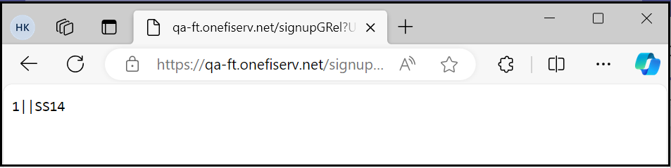

## Error Handling / Error Codes

The TN service contains a robust error handling framework that will alert both the Client and end user to potential issues when attempting to access or during use of the service. Additionally, there may be that rare instance when the Client is unable to access the service because either the Fiserv ePayments Client Integration Server is unavailable, or the Fiserv ePayments TN Application Server is unavailable.  

The sub-sections that follow provide the Client with the needed insight into possible service errors and what steps, if any, the Client will need to take to handle such errors. 

**Fiserv ePayments Client Integration or Web Application Server Not Available Error Codes**

If the Fiserv Integration Server becomes unexpectedly unavailable when the Client sends an end user payload, the Client will receive one of the following errors: 

    <ul>
        <li>HTTP <b>500</b> Internal Server Error.  
        </li>
        <li>HTTP <b>502</b> Bad Gateway Error.  
        </li>
        <li>HTTP <b>503</b> Service Unavailable Error. 
        </li>
    </ul>

If the Fiserv  TN Application Server becomes unexpectedly unavailable as part of the Client end user redirect to the TN service, the Client will receive one of the following errors: 

    <ul>
        <li>HTTP <b>403</b> Server Refusing to Respond to Request Error.  
        </li>
        <li>HTTP <b>404</b> Service Not Found Error. 
        </li>
    </ul>

<!-- theme: info -->

>:memo:_**Note:** The Client will need to perform the proper error handling for any of the above returned errors, as well as inform the end user that the service is temporarily unavailable._ 

## Fiserv Payload Submission Error Codes

As mentioned in [SSO - Payload Secure Message Exchange](?path=docs/getting-started/TN-Integration-Guide/SSO-Guidelines/payload-secure-msg.md) , the Fiserv ePayments Client Integration Server will return to the Client, one or more SS error codes in the https response if a problem with a client submitted payload is detected.  

For example, as noted in [ Client/Fiserv Secure Message Exchange Payload Parameters](?path=docs/getting-started/TN-Integration-Guide/SSO-Guidelines/payload-parameters.md), one of the required elements that must be submitted to Fiserv in the payload is the end user’s Social Security number. Failure to include this required name/value pair element in the payload would result in the Fiserv Client Integration Server returning an SS14 error code rather than a valid session key. 

&nbsp;

  

&nbsp;

<!-- theme: info -->

>:memo:_**Note:** The "1" preceding the two pipe characters ("||") indicates that the payload submission failed, and the SS14 following the two pipe characters represents the SS error code. If the payload submission resulted in multiple error codes being returned in the response, then a comma delimited list of error codes, following the two pipe characters, would be returned._  

[SS Error Codes Returned by Fiserv-Table](?path=docs/getting-started/TN-Integration-Guide/SSO-Tables/table-4.md) lists all the SS error codes that Fiserv will return to the Client in the https response because of the Client submitting an invalid payload; the Client will need to perform the proper error handling for any of the listed returned errors. 

  <table style="width: 100%;" class="err-table">
            <thead>
                <tr>
                    <th> Card Account Profile Parameter</th>
                    <th> Description, Usage Restriction, and error flow </th>
                </tr>
            </thead>
            <tbody>
                <tr>
                    <td rowspan="1">SS14</td>
                    <td>Fiserv will return this error code if any of the following are true: 
                    

                        <ul>
                            <li> The SSN parameter is not present in the payload</li>
                            <li> The associated value has a length of 0 characters</li>
                        </ul>
                    

                    </td>
                </tr>
                <tr>
                    <td rowspan="1">SS15</td>
                    <td>Fiserv will return this error code if any of the following are true: 
                    

                        <ul>
                            <li> The FIRST_NAME parameter is not present in the payload</li><li> The associated value has a length of 0 or is > than 30 characters.
                            </li>
                        </ul>
                    

                    </td>
                </tr>
                <tr>
                    <td rowspan="1">SS16</td>
                    <td>Fiserv will return this error code if any of the following are true: 
                    

                        <ul>
                            <li> The LAST_NAME parameter is not present in the payload</li><li> The associated value has a length of 0 or is > than 30 characters</li>
                        </ul>
                    

                    </td>
                </tr>
                <tr>
                    <td rowspan="1">SS17</td>
                    <td>Fiserv will return this error code if any of the following are true: 
                    

                        <ul>
                            <li> The CITY parameter is not present in the payload</li><li>The associated value has a length of 0 or is > than 25 characters
                            </li>
                        </ul>
                    

                    </td>
                </tr>
                <tr>
                    <td rowspan="1">SS18</td>
                    <td>Fiserv will return this error code if any of the following are true: 

                        <ul>
                            <li> The STATE parameter is not present in the payload</li><li> The associated value is not a valid state or US territory</li><li> The associated value has length of 0, 1 or > 25 characters</li>
                            </ul>
                            
</td>
                </tr>
                <tr>
                    <td rowspan="1">SS19</td>
                    <td>Fiserv will return this error code if any of the following are true:  

                        <ul>
                            <li> The STREET parameter is not present in the payload</li><li> The associated value has a length of 0 or is > than 60 characters</li>,</ul>
                            
</td>
                </tr>
                <tr>
                    <td rowspan="1">SS20</td>
                    <td>Fiserv will return this error code if any of the following are true: 

                        <ul>
                            <li> The ZIP parameter is not present in the payload</li><li> The associated value has a length of < than 5 characters</li><li> The associated value contains one or more non-numeric characters within the first five digit positions</li></ul>
                            
</td>
                </tr>
                <tr>
                    <td rowspan="1">SS21</td>
                    <td>Fiserv will return this error code if any of the following are true: 

                        <ul>
                            <li> The DOB parameter is not present in the payload</li><li> The associated value has a length of 0</li><li> The end user’s calculated age is < 18 or > 110</li><li> The associated MM/DD/YYYY value is equal to 01/01/1901 or YYYY equals 1900</li>
                        </ul>
                    
</td>
                </tr>
                <tr>
                    <td rowspan="1">SS22</td>
                    <td>Fiserv will return this error code if any of the following are true: 

                        <ul>
                            <li> The PHONE parameter is not present in the payload</li><li> The associated value has a length of 0</li></ul>
</td>
                </tr>
                <tr>
                    <td rowspan="1">SS28</td>
                    <td>Fiserv will return this error code if any of the following are true: 

                        <ul>
                            <li> The INSTITUTION_ID parameter is not present in the payload</li><li> The associated value has a length of 0</li></ul>
</td>
                </tr>
                <tr>
                    <td rowspan="1">SS29</td>
                    <td>Fiserv will return this error code if any of the following are true: 

                        <ul>
                            <li> The RTN0 parameter is not present in the payload</li><li> The associated value has a length of 0</li><li> The associated value is not a valid ABA/routing number</li></ul>
</td>
                </tr>
                <tr>
                    <td rowspan="1">SS30</td>
                    <td>Fiserv will return this error code if any of the following are true: 

                        <ul>
                            <li> The USER_FI_NUMBER parameter is not present in the payload</li><li> The associated value has a length of 0</li></ul>
</td>
                </tr>
                <tr>
                    <td rowspan="1">SS31</td>
                    <td>Fiserv will return this error code if any of the following are true: 

                        <ul>
                            <li> The ANUM0 parameter is not present in the payload</li><li> The associated value has a length of 0</li></ul>
</td>
                </tr>
                <tr>
                    <td rowspan="1">SSB14</td>
                    <td>EIN is invalid</td>
                </tr>
            </tbody>
        </table>

## Fiserv ePayments TN Application Error Codes

As mentioned in [SSO - Payload Secure Message Exchange](?path=docs/getting-started/TN-Integration-Guide/SSO-Guidelines/payload-secure-msg.md) , the Fiserv ePayments Client Integration Server will display, to the end user, an application error page containing one or more SS error codes if an application error is thrown. 

Unlike the error codes listed in [Fiserv Payload Submission Error Codes](?path=docs/getting-started/TN-Integration-Guide/SSO-Guidelines/payload-submission.md) , application error codes do not require the Client to perform any additional error handling because an application error page will only be displayed after the end user has been granted access to the service. 

&nbsp;

  SS24 Your Profile is already registered.

&nbsp;

[SS Error Codes Returned by Fiserv-Table](?path=docs/getting-started/TN-Integration-Guide/SSO-Tables/table-4.md) lists all the SS error codes that Fiserv will display in an application error page to the service end user. The Client does not need to perform additional error handling for any of the listed error codes. 

  <table style="width: 100%;" class="err-table">
            <thead>
                <tr>
                    <th> Application Error Code</th>
                    <th> Displayed Error Message </th>
                    <th>Meaning</th>
                </tr>
            </thead>
            <tbody>
                <tr>
                    <td rowspan="1">SS23</td>
                    <td>Unable to access the TN service at this time</td>
                    <td>Fiserv will display this error code and message in an application error page if the TN service is accessible but the required user data cannot be retrieved from the back-end database.</td>
                </tr>
                <tr>
                    <td rowspan="1">SS24</td>
                    <td>Your profile is already registered</td>
                    <td>The passed in payload parameter value combination of FIRST_NAME, LAST_NAME, SSN, and DOB has already been associated with some other USER_FI_NUMBER</td>
                </tr>
                <tr>
                    <td rowspan="1">SS25</td>
                    <td>Your account is locked</td>
                    <td></td>
                </tr>
                <tr>
                    <td rowspan="1">SS40</td>
                    <td>Unable to authenticate, please log in again.</td>
                    <td>Submitted session key is null</td>
                </tr>
                <tr>
                    <td rowspan="1">SS41</td>
                    <td>Unable to authenticate, please log in again.</td>
                    <td>Submitted session key is invalid</td>
                </tr>
                <tr>
                    <td rowspan="1">SS42</td>
                    <td>Unable to authenticate, please log in again.</td>
                    <td>General application error</td>
                </tr>
                <tr>
                    <td rowspan="1">SS67</td>
                    <td>Missing or invalid email</td>
                    <td>The email parameter is not present in payload, the associated value has a length of 0 or is invalid AND the Client is not allowing end users to edit or delete email addresses from within the TN application.</td>
                </tr>
            </tbody>
        </table>

