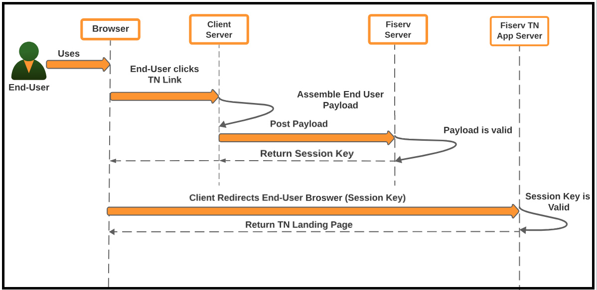

## SSO - Payload Secure Message Exchange

Assume a client’s end user has logged into the Client’s web page and now attempts to access the service via the Client’s TN page link. Before the Fiserv ePayments Client Integration Server can grant access to the requested service, it expects that the Client has included as part of the access request information specific to the end user only (i.e., account data, contact information, etc.). Upon receiving this end user payload information, the Fiserv ePayments Client Integration Server will check to ensure that all required information is part of the request; if the Fiserv ePayments Client Integration Server deems the payload as being valid, it will return an application session key back to the Client’s server. The Client will then use this session key as part of the end user redirect to the Fiserv ePayments Application Server. 

&nbsp;

  

## See Also
[Payload Parameters](?path=docs/getting-started/TN-Integration-Guide/SSO-Guidelines/payload-parameters.md)   
[Error Handling / Error Codes](?path=docs/getting-started/TN-Integration-Guide/SSO-Guidelines/error-handling-error-codes.md)      
[Payload Submission](?path=docs/getting-started/TN-Integration-Guide/SSO-Guidelines/payload-submission.md)   

     
    

        <a href="?path=docs/getting-started/TN-Integration-Guide/transfernow-integration-guide.md">Back</a>
    

    

        <a href="?path=docs/getting-started/TN-Integration-Guide/SSO-Guidelines/payload-secure-msg.md">Next</a>
    

