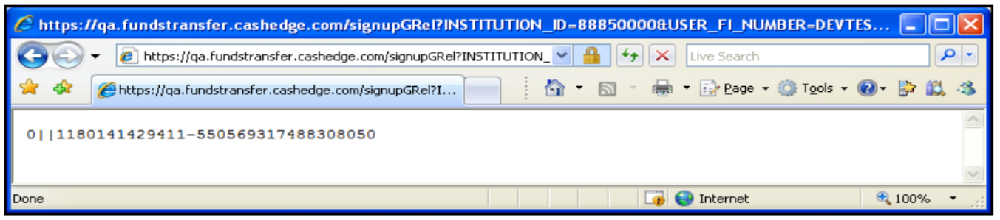
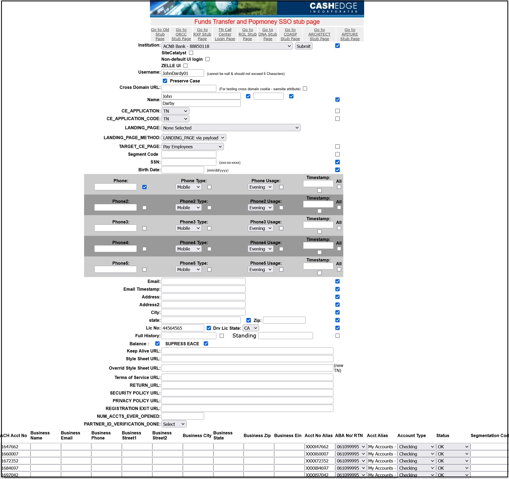
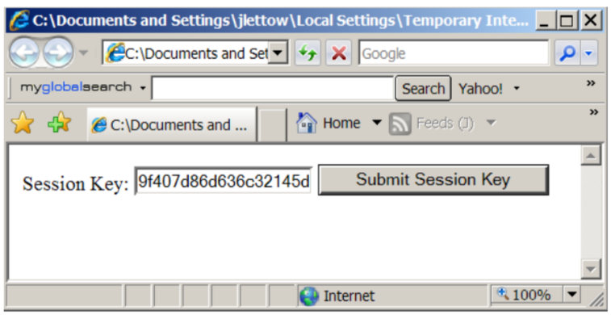

## Payload Submission


Clients are required to submit end user payloads to the Fiserv Client Integration Server via ` https://sso.fta.cashedge.com/signupGRel?<payload> ` the Client end user submitted payload—which would get appended to the end of each respective URL (thus replacing the &lt; payload &gt; substring)
 

upon receiving this end user payload information, the Fiserv Client Integration Server will check to ensure that all required information is part of the request. If the Fiserv Client Integration Server deems the payload as being valid, it will return an application session key back to the Client’s server; otherwise, it will return an SS error code (see [Fiserv Payload Submission Error Codes](?path=docs/getting-started/TN-Integration-Guide/SSO-Guidelines/error-handling-error-codes.md)). 

Valid Session Key is shown below:
<center>

 <br />


</center>


&nbsp;


<!-- theme: info -->

>:memo:_**Note:** The value for all valid session keys returned in the Fiserv Client Integration Server response are preceded with a '0', followed by two pipe characters ("||")._ 

&nbsp;

After the Client captures the session key value returned in the response from the Fiserv Client Integration Server, the Client would then append this value to one of the session key submissions URL ` https://transfers.fta.cashedge.com/popmmp/faces/loginServlet?INSTITUTION_ID=&KEY= ` , just after the KEY = string (thus replacing the substring). 

&nbsp;

<!-- theme: info -->

>:memo:_**Note:** The URL contains a substring; this substring needs to be replaced by the Fiserv assigned home ID servlet, which is unique to each Client before the Client can successfully redirect the end user’s browser to that URL._


## Payload Session Key Expiration Period 

When the Fiserv Client Integration Server returns a session key in response to a client submitted end user payload, the key is only valid for a short period of time and, therefore, must be submitted to the key submission URL ` https://transfers.fta.cashedge.com/popmmp/faces/loginServlet?INSTITUTION_ID=&KEY= `, before the session key validation period expires. 

<!-- theme: info -->

>:memo:_**Note:**  If the Client performs the redirect after the session key has expired, the service will display an SS41 error page. See [Fiserv ePayments TN Application Error Codes](?path=docs/getting-started/TN-Integration-Guide/SSO-Guidelines/error-handling-error-codes.md)._ 

The Client is requesting the following session key expiration period: 

<html>
  <table style="width: 100%;">
            <thead>
                <tr>
                    <th>Session Key Expiration</th>
                    <th> Description</th>
                </tr>
            </thead>
            <tbody>
                <tr>
                    <td rowspan="2">Payload Session Key Expiration Period</td>
                </tr>
                <tr>
                    <td>For Fiserv ePayments Production Environment</br>
                    • Client wishes session key to be valid only for 5 minutes (default)</td>
                </tr>
            </tbody>
        </table>
</html>


## Perform a Payload Submission Using Only a Web Browser

Assume that the Client wishes to submit the payload parameters shown in the table below to the Fiserv TN service QA environment. 

<html>
<style>
    tbody:nth-child(odd)
     {
         background-color: #dddddd;
    }
    table
    {
        margin-left:auto;
        margin-right:auto;
    }
</style>
    <table style="width: 70%;" class="err-table">
            <thead>
                <tr>
                    <th> Payload Parameter</th>
                    <th> Parameter Value </th>
                </tr>
            </thead>
            <tbody>
                <tr>
                    <td rowspan="1">INSTITUTION_ID </br></td>
                    <td>88850000</td>
                </tr>
                <tr>
                    <td rowspan="1">USER_FI_NUMBER </br></td>
                    <td>endUser12</td>
                </tr>
                <tr>
                    <td rowspan="1">FIRST_NAME </br></td>
                    <td>JOE</td>
                </tr>
                <tr>
                    <td rowspan="1">LAST_NAME </br></td>
                    <td>SMITH</td>
                </tr>
                <tr>
                    <td rowspan="1">EMAIL </br></td>
                    <td>jlettow@cashedge.com</td>
                </tr>
                <tr>
                    <td rowspan="1">STREET </br></td>
                    <td>180 ELM COURT</td>
                </tr>
                <tr>
                    <td rowspan="1">CITY </br></td>
                    <td>SUNNYVALE</td>
                </tr>
                <tr>
                    <td rowspan="1">STATE </br></td>
                    <td>CA</td>
                </tr>
                <tr>
                    <td rowspan="1">ZIP </br></td>
                    <td>19705</td>
                </tr>
                <tr>
                    <td rowspan="1">SSN </br></td>
                    <td>123456789</td>
                </tr>
                <tr>
                    <td rowspan="1">DOB </br></td>
                    <td>02/23/1970</td>
                </tr>
                <tr>
                    <td rowspan="1">PHONE </br></td>
                    <td>9999999999</td>
                </tr>
                <tr>
                    <td rowspan="1">DRV_LIC</br></td>
                    <td>99999999</td>
                </tr>
                <tr>
                    <td rowspan="1">DRV_LIC_STATE</br></td>
                    <td>CA</td>
                </tr>
                <tr>
                    <td rowspan="1">USER_IN_GOOD_STANDING</br></td>
                    <td>1</td>
                </tr>
                <tr>
                    <td rowspan="1">ANUM0</br></td>
                    <td>5345435</td>
                </tr>
                <tr>
                    <td rowspan="1">ASEG0</br></td>
                    <td>AA</td>
                </tr>
                <tr>
                    <td rowspan="1">ADSC0</br></td>
                    <td>HIGH INTEREST SAVINGS</td>
                </tr>
                <tr>
                    <td rowspan="1">ATYP0</br></td>
                    <td>0</td>
                </tr>
                <tr>
                    <td rowspan="1">ASTAT0</br></td>
                    <td>0</td>
                </tr>
                <tr>
                    <td rowspan="1">BALANCE0</br></td>
                    <td>193792.99</td>
                </tr>
                <tr>
                    <td rowspan="1">RTN0</br></td>
                    <td>272482391</td>
                </tr>
                <tr>
                    <td rowspan="1">ANUM1</br></td>
                    <td>5357780</td>
                </tr>
                <tr>
                    <td rowspan="1">ASEG1</br></td>
                    <td>BB</td>
                </tr>
                <tr>
                    <td rowspan="1">ADSC1</br></td>
                    <td>FREE CHECKING</td>
                </tr>
                <tr>
                    <td rowspan="1">ATYP1</br></td>
                    <td>1</td>
                </tr>
                <tr>
                    <td rowspan="1">ASTAT1</br></td>
                    <td>0</td>
                </tr>
                <tr>
                    <td rowspan="1">BALANCE1</br></td>
                    <td>10000.00</td>
                </tr>
                <tr>
                    <td rowspan="1">RTN1</br></td>
                    <td>272482391</td>
                </tr>
            </tbody>
        </table>

submit this payload to the Fiserv TN service demonstration servlet and click the Submit Payload button. 

&nbsp;

<center>

 <br />


</center>

&nbsp;

Once you click the Submit Payload button, a second browser window will open and display the session key returned from the Fiserv Client Integration Server.  

When the Submit Payload button is clicked, the payload shown in the example form gets submitted as an HTTPS payload POST via the URL below: 

```https://certsso.ft.cashedge.com/signupGRel?&INSTITUTION_ID=88850000&USER_FI_NUMBER=endUser12&FIRST_NAME=JOE&LAST_NAME=SMITH&EMAIL=jlettow@cashedge.com&STREET=180%20ELM%20COURT&CITY=SUNNYVALE&STATE=CA&ZIP=19705&SSN=123456789&DOB=02/23/1970&PHONE=9999999999&DRV_LIC=99999999&DRV_LIC_STATE=CA&USER_IN_GOOD_STANDING=1&LANGUAGE=ENGLISH&ANUM0=5345435&ASEG0=AA&ADSC0=HIGH%20INTEREST%20SAVINGS&ATYP0=0&ASTAT0=0&BALANCE0=193792.99&RTN0=272482391&ANUM1=5357780&ASEG1=BB&ADSC1=FREE%20CHECKING&ATYP1=1&ASTAT1=0&BALANCE1=10000.00&RTN1=272482391```

Sample payload when business accounts are passed: 

```https://certsso.ft.cashedge.com/signupGRel?USER_FI_NUMBER=endUser12&&FIRST_NAME=JOE&MIDDLE_NAME=V&LAST_NAME=SMITH&DOB=02/23/1970&SSN=970565443&EMAIL=bodBizSupport@cashedge.com&PHONE=34556546543&ZIP=19705&STREET=180%20ELM%20COURT&STREET2=&CITY=sunnyvale&STATE=CA&INSTITUTION_ID=88851116&DRV_LIC=44564565&DRV_LIC_STATE=CA&ANUM0=9936977&ATYP0=6&ASTAT0=0&ASEG0=&BALANCE0=116936.38&DATE_ACT_OPENED0=07/2014&ACCOUNT_NUMBER0=XXXX36977&RTN0=113024274&BUSINESS_NAME0=ABC%20INC.&BUSINESS_EMAIL0=CS@ABCtest.com&BUSINESS_PHONE0=2345678901&BUSINESS_STREET0=180%20ELM%20COURT&BUSINESS_STREET20=&BUSINESS_CITY0=Sunnyvale&BUSINESS_STATE0=CA&BUSINESS_ZIP0=94555&BUSINESS_EIN0=123456&ADSC0=FREE%20BIZ%20CHECKING```


## Perform a Session Key Submission Using only a Web Broswer

Performing a session key submission to the Fiserv Service Application Server happens only after a valid payload has been previously submitted to the Fiserv Client Integration Server and a resultant valid session key value has then been returned by this server. 

Now copy the session key value returned to you into the Session Key text box and click Submit Session Key. 

&nbsp;

<center>

 <br />


</center>


<style>
.center {
  display: block;
  margin-left: auto;
  margin-right: auto;
  height:300;
  width:400;
}
.err-table {
  font-family: Arial, Helvetica, sans-serif;
  border-collapse: collapse;
  width: 100%;
}

.err-table td, .err-table th {
  border: 1px solid #ddd;
  padding: 8px;
}
.err-table th {
    background-color:#f1f1f1
}

.err-table tr:nth-child(even){background-color: #f2f2f2;}

.err-table tr:hover {background-color: #ddd;}

</style>
&nbsp;

When the Submit Session Key button is clicked, the session key value is being submitted to a URL. If the session key you submitted is verified as being valid, the end user will be logged into the Fiserv TN service demonstration application. 

Alternatively, you can enter the URL directly into your browser’s address bar and then press enter. 

` https://certtransfers.fta.cashedge.com/popmmp/faces/loginServlet?INSTITUTION_ID=&KEY=9f407d86d636c32145dd7f05062230ae `
