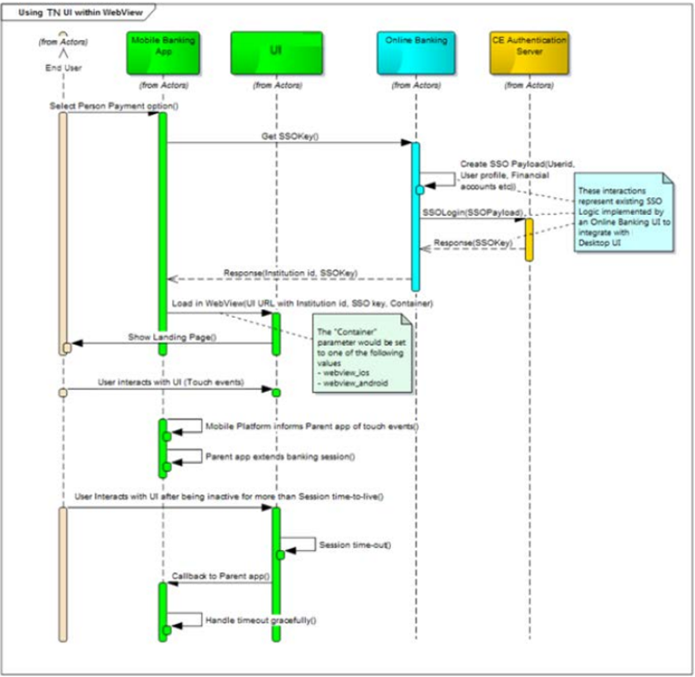

## TN Mobile Integration Guide

This provides an architectural overview of the mobile integration and invoking of TransferNow.


<center>



</center>


## SSO for Mobile

This leverages the TransferNow SSO built for online banking. The parent app will need to get that one-use SSO key from the existing middleware. The SSOkey will then be appended to the URL to invoke TransferNow in the webview. URL’s would be confirmed during the implementation , clients continue to invoke the existing TransferNow URL and would internally get directed to the TransferNow UI.

&nbsp;

> :memo: **Note:** Home id and a flag to indicate that the UI is being launched from within an app will also be passed in.


&nbsp;

## Sample Pseudocode for Invoking WebView

### Android

```

WebView loadView = (WebView)eSignDetailView.findViewById(R.id.);
loadView.getSettings().setJavaScriptEnabled(true);
loadView.setWebChromeClient(new WebChromeClient());
loadView.loadUrl(<>);

```

### iOS

```

- (void)viewDidLoad {
    
    [super viewDidLoad];
    NSURL *url = [NSURL URLWithString:@"<>"]; 
    NSURLRequest *urlRequest = [NSURLRequest requestWithURL:url]; 
    [self. responsiveUIWebView loadRequest:urlRequest]; 
    self. responsiveUIWebView .delegate = self;
 }


```

## See Also

[Session Management](?path=docs/getting-started/session_management.md)