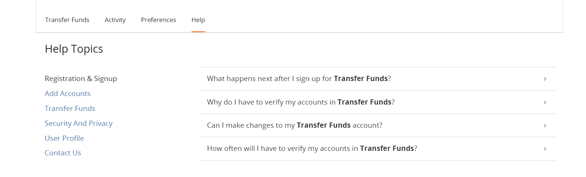

## Help Link Configuration 

Fiserv-hosted TN pages contain an optional Help link that, when clicked, will display a Fiserv specific help page, as shown in the following figure. 

 

&nbsp;

  

 

**To Know more visit the below Configuration:**

[Page Footer Configuration](?path=docs/getting-started/TN-UI-Widget/Page_Footer_Configuration.md)    
[Session Timeout Configuration](?path=docs/getting-started/TN-UI-Widget/Session_Timeout_Configuration.md)    
[Session Keep-Alive Configuration ](?path=docs/getting-started/TN-UI-Widget/Session_Keep-Alive_Configuration.md)    

<!-- theme: info -->

> :memo: _**Note:** The Client preference for this option is to be indicated in the DGF._