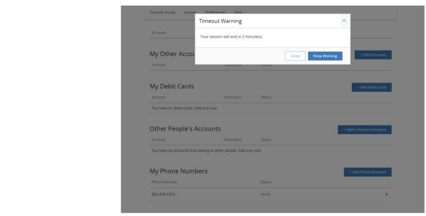

## Session Timeout Configuration 

With Full Control or Framed implementations, an end user session timeout on the Fiserv side will result in the browser redirecting the end user to a Client specified URL initially passed to Fiserv by the Client as part of an end user payload post. For the Pop-Up implementation, Fiserv first informs the end user, via a dialog box (see the figure that follows), that their session has expired on the Fiserv side and after the end user clicks OK, the dialog box closes and the pop-up window would then redirect to the Client specified URL. 

&nbsp;

  

 

The Client specified return URL is passed in as part of each end user’s payload post; Failure to pass a return URL in the end user’s payload will result in the end user being redirected to the Client’s specified Logout URL.  

Finally, Fiserv suggests that the Client configure a session timeout expiration period to be less than that used as the session timeout period on the client’s side. 

 

<!-- theme: info -->

> :memo: _**Note:** The Client preference for this option is to be indicated in the DGF._ 

**To Know more visit the below Configuration:**

[Page Footer Configuration](?path=docs/getting-started/TN-UI-Widget/Page_Footer_Configuration.md)    
[Help Link Configuration](?path=docs/getting-started/TN-UI-Widget/Help_Link_Configuration.md)    
[Session Timeout Configuration](?path=docs/getting-started/TN-UI-Widget/Session_Timeout_Configuration.md)    
[Session Keep-Alive Configuration ](?path=docs/getting-started/TN-UI-Widget/Session_Keep-Alive_Configuration.md)  