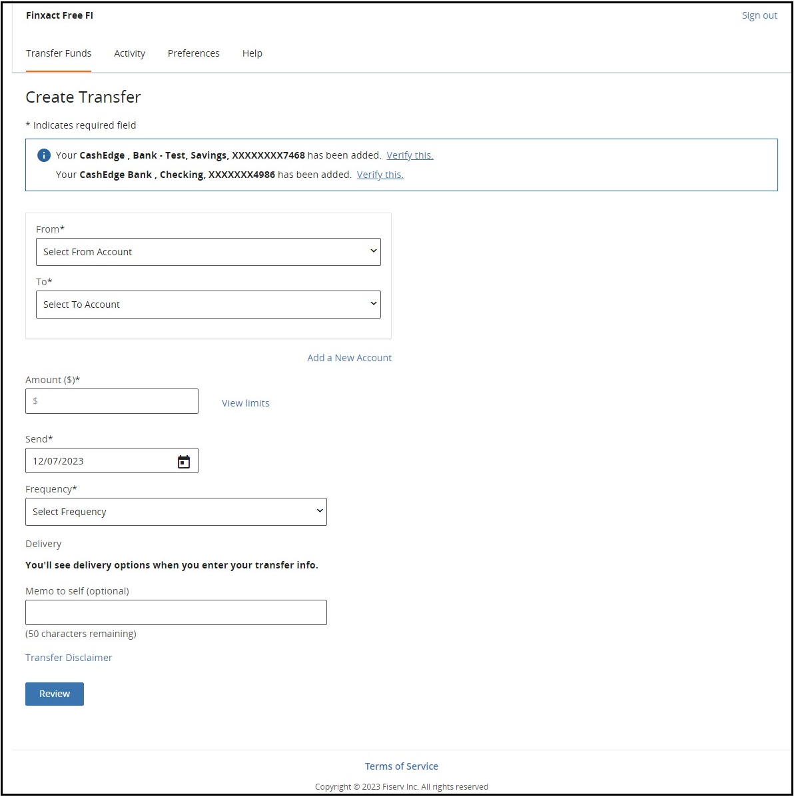

## TN UI Rendering Options  

## Page Hosting Options 

Fiserv provides the client with an HTML URL, which the client embeds into a hyperlink (or button) on their web site. When a user clicks on the hyperlink, the client “hands off” the user to Fiserv. From that point on, all the screens that the user sees are built and maintained by Fiserv per the client’s instructions in the DGF. 

With the Fiserv ePayments-hosted UI solution, clients control how they launch the TransferNow service. They choose from the following types of implementations: 

<div class="card-body">
<ul>
<li>Full Control </li>
<li>Framed</li>
<li>Pop-up.</li>
</ul>
</div>

<!-- theme: info -->

> :memo: _**Note:** Almost all clients who choose the Fiserv ePayments-hosted UI solution opt for the full-control implementation_


<!--

type: tab

titles: Full Control , Framed, Pop-up

-->


## Full Control

A Client-initiated end user session will result in all respective Fiserv-hosted web pages rendering in a window initially used to display the Client web page. Therefore, the user is directed to TransferNow screens that use the same window as the FI’s web page. 

&nbsp;

<center>

 <br />


</center> 
</br>

**To Know more visit the below Configuration:**

<div>
 <input type="checkbox" class="collapsible-checkbox" id="section1">
    <label class="label-expand" for="section1">Page Footer Configuration</label>
    <div class="content-expand">
<p>Most Fiserv-hosted pages display a footer containing Client-defined URLs that link to the Client’s Terms of Service, Security Policy, and Privacy Policy. Each URL, when selected, will result in the content being displayed in a separate pop-up window. 
</br></br>
Also, content that each URL points to is hosted by the Client and not Fiserv, and if the Client does not define a URL for one of the footer links, then that link will not be displayed on any applicable Fiserv hosted page. 
</p>
</br>
<p class = "block-quote">Note:<i>The Client preference for this option is to be indicated in the DGF.</i></p>
</div>
</div> </br>
<div>
 <input type="checkbox" class="collapsible-checkbox" id="section2">
    <label class="label-expand" for="section2">Help Link Configuration</label>
    <div class="content-expand">
Fiserv-hosted TN pages contain an optional Help link that, when clicked, will display a Fiserv specific help page, as shown in the following figure.
</br>
<center>


</center> 
</br>
<p class = "block-quote">Note:<i>The Client preference for this option is to be indicated in the DGF.</i></p>
</div>
</div> 
</br>
<div>
 <input type="checkbox" class="collapsible-checkbox" id="section3">
    <label class="label-expand" for="section3">Session Timeout Configuration</label>
    <div class="content-expand">
<p>With Full Control or Framed implementations, an end user session timeout on the Fiserv side will result in the browser redirecting the end user to a Client specified URL initially passed to Fiserv by the Client as part of an end user payload post. For the Pop-Up implementation, Fiserv first informs the end user, via a dialog box (see the figure that follows), that their session has expired on the Fiserv side and after the end user clicks OK, the dialog box closes and the pop-up window would then redirect to the Client specified URL. </p>


<center>

</br>

</center> 

<p>The Client specified return URL is passed in as part of each end user’s payload post; Failure to pass a return URL in the end user’s payload will result in the end user being redirected to the Client’s specified Logout URL. </p>

<p>Finally, Fiserv suggests that the Client configure a session timeout expiration period to be less than that used as the session timeout period on the client’s side.</p>
</br>
<p class = "block-quote">Note:<i>The Client preference for this option is to be indicated in the DGF.</i></p>
</div>
</div> </br>
<div>
 <input type="checkbox" class="collapsible-checkbox" id="section4">
    <label class="label-expand" for="section4">Session Keep-Alive Configuration</label>
    <div class="content-expand">
<p>To keep an end user’s initiating Client-side session alive, a URL is embedded into all the Fiserv hosted pages that links to a blank 1x1 pixel image hosted on the Client’s web server. Fiserv will retrieve this image from the Client’s web server at periodic intervals via Fiserv hosted page code, or whenever a new Fiserv hosted page is displayed or refreshed. This essentially tricks the Client’s web server into thinking that the request came from the end user’s originating Client-side session. </p>
</br>
<p>For example, assume an end user logs into a Client web server (thus creating a new Client-side session) and that the end user is then presented with a browser page composed of images loaded from that same web server’s image deployment directory called client_app/images. Assume also that this directory contains a blank 1x1 pixel called keepalive.gif. The end user now clicks on a link that allows him/her to access the service. When the Fiserv web server serves up the requested page, that page contains a link to the keepalive.gif image contained in the Client’s client_app/images directory: </p>

``` 
https://www.someclient.com/client_app/images/keepalive.gif

```

</br>
<p>Thus, to the Client’s web server it looks as if the image is being retrieved via the end user’s initiating session and, therefore, will flag the end user’s session as still being active. </p>
</br>
<p>If a gif is not available on the Client web server responsible for creating the end user’s original session (i.e., a different server is used to manage images), a user’s session can still be kept alive via a URL that returns an empty page as long as the URL points to a resource hosted on that same web server. An example of such a URL might be: </p>

```
https://www.someclient.com/client_app/jsp/keepAlive.jsp` 

```

</br>
<p class = "block-quote">Note:<i>The Client preference for this option is to be indicated in the DGF.</i></p>
</div>
</div> </br>

**See Also**

[First-Time Agreement Page Configuration](?path=docs/getting-started/TN-UI-Widget/First-Time_Agreement_Page_Configuration.md)
<!-- type: tab -->


## Framed 

A Client-initiated end user session will result in all respective Fiserv-hosted web pages rendering in a single frame embedded within the client’s parent web page. The Fiserv screens are embedded in a frame that is built and maintained by the client. 

<!-- theme: info -->

> :memo: _**Note:** The size of this frame is controlled by the Client._

The navigation in the frame links only to screens within TransferNow. In this implementation, an FI has the option to remove the header and footer, so only the working area of the application is displayed in the frame. 

At the point of exit from TransferNow (which is running within a frame), the frame will disappear, and the full screen FI web page will be visible. 

&nbsp;

<center>

 <br />


</center> 

</br>
**To Know more visit the below Configuration:**

<div>
 <input type="checkbox" class="collapsible-checkbox" id="section5">
    <label class="label-expand" for="section5">Page Footer Configuration</label>
    <div class="content-expand">
<p>Most Fiserv-hosted pages display a footer containing Client-defined URLs that link to the Client’s Terms of Service, Security Policy, and Privacy Policy. Each URL, when selected, will result in the content being displayed in a separate pop-up window. 
</br></br>
Also, content that each URL points to is hosted by the Client and not Fiserv, and if the Client does not define a URL for one of the footer links, then that link will not be displayed on any applicable Fiserv hosted page. 
</p>
</br>
<p class = "block-quote">Note:<i>The Client preference for this option is to be indicated in the DGF.</i></p>
</div>
</div> </br>
<div>
 <input type="checkbox" class="collapsible-checkbox" id="section6">
    <label class="label-expand" for="section6">Help Link Configuration</label>
    <div class="content-expand">
Fiserv-hosted TN pages contain an optional Help link that, when clicked, will display a Fiserv specific help page, as shown in the following figure.
</br>
<center>


</center> 
</br>
<p class = "block-quote">Note:<i>The Client preference for this option is to be indicated in the DGF.</i></p>
</div>
</div> 
</br>
<div>
 <input type="checkbox" class="collapsible-checkbox" id="section7">
    <label class="label-expand" for="section7">Session Timeout Configuration</label>
    <div class="content-expand">
<p>With Full Control or Framed implementations, an end user session timeout on the Fiserv side will result in the browser redirecting the end user to a Client specified URL initially passed to Fiserv by the Client as part of an end user payload post. For the Pop-Up implementation, Fiserv first informs the end user, via a dialog box (see the figure that follows), that their session has expired on the Fiserv side and after the end user clicks OK, the dialog box closes and the pop-up window would then redirect to the Client specified URL. </p>


<center>

</br>

</center> 

<p>The Client specified return URL is passed in as part of each end user’s payload post; Failure to pass a return URL in the end user’s payload will result in the end user being redirected to the Client’s specified Logout URL. </p>

<p>Finally, Fiserv suggests that the Client configure a session timeout expiration period to be less than that used as the session timeout period on the client’s side.</p>
</br>
<p class = "block-quote">Note:<i>The Client preference for this option is to be indicated in the DGF.</i></p>
</div>
</div> </br>
<div>
 <input type="checkbox" class="collapsible-checkbox" id="section8">
    <label class="label-expand" for="section8">Session Keep-Alive Configuration</label>
    <div class="content-expand">
<p>To keep an end user’s initiating Client-side session alive, a URL is embedded into all the Fiserv hosted pages that links to a blank 1x1 pixel image hosted on the Client’s web server. Fiserv will retrieve this image from the Client’s web server at periodic intervals via Fiserv hosted page code, or whenever a new Fiserv hosted page is displayed or refreshed. This essentially tricks the Client’s web server into thinking that the request came from the end user’s originating Client-side session. </p>
</br>
<p>For example, assume an end user logs into a Client web server (thus creating a new Client-side session) and that the end user is then presented with a browser page composed of images loaded from that same web server’s image deployment directory called client_app/images. Assume also that this directory contains a blank 1x1 pixel called keepalive.gif. The end user now clicks on a link that allows him/her to access the service. When the Fiserv web server serves up the requested page, that page contains a link to the keepalive.gif image contained in the Client’s client_app/images directory: </p>

```
https://www.someclient.com/client_app/images/keepalive.gif

```

</br>
<p>Thus, to the Client’s web server it looks as if the image is being retrieved via the end user’s initiating session and, therefore, will flag the end user’s session as still being active. </p>
</br>
<p>If a gif is not available on the Client web server responsible for creating the end user’s original session (i.e., a different server is used to manage images), a user’s session can still be kept alive via a URL that returns an empty page as long as the URL points to a resource hosted on that same web server. An example of such a URL might be: </p>

```
https://www.someclient.com/client_app/jsp/keepAlive.jsp

```
</br>
<p class = "block-quote">Note:<i>The Client preference for this option is to be indicated in the DGF.</i></p>
</div>
</div> </br>

**See Also**

[First-Time Agreement Page Configuration](?path=docs/getting-started/TN-UI-Widget/First-Time_Agreement_Page_Configuration.md)

 <!-- type: tab -->


## Pop-up 

A Client-initiated end user session will result in all respective Fiserv-hosted web pages rendering within a second single browser pop-up window. when the user clicks on the Fiserv ePayments-provided HTML URL, a new window with the TransferNow application appears. Users work within the new window. 

&nbsp;

<center>

 <br />


</center> 

The size of the browser pop-up window is controlled by the Client via code that gets added to the access link on the Client side. Below is an example of such code. 

 

```
<a href="#"  

onClick="popup=window.open(https://qa.fundstransfer.cashedge.com/signupGRel',  

'PopupPage', 'width=700, height=500, scrollbars=yes,resizable=yes, 

toolbar=no, menubar=no'); return false;">Click to open</a>
```
 

<!-- theme: info -->

> :memo: _**Note:** If the Client chooses not to control the size of the pop-up browser window, then the default browser pop-up created will open in full screen mode which will most likely cover the client’s original parent window responsible for spawning the pop-up._
</br>

**To Know more visit the below Configuration:**

<div>
 <input type="checkbox" class="collapsible-checkbox" id="section9">
    <label class="label-expand" for="section9">Page Footer Configuration</label>
    <div class="content-expand">
<p>Most Fiserv-hosted pages display a footer containing Client-defined URLs that link to the Client’s Terms of Service, Security Policy, and Privacy Policy. Each URL, when selected, will result in the content being displayed in a separate pop-up window. 
</br></br>
Also, content that each URL points to is hosted by the Client and not Fiserv, and if the Client does not define a URL for one of the footer links, then that link will not be displayed on any applicable Fiserv hosted page. 
</p>
</br>
<p class = "block-quote">Note:<i>The Client preference for this option is to be indicated in the DGF.</i></p>
</div>
</div> </br>
<div>
 <input type="checkbox" class="collapsible-checkbox" id="section10">
    <label class="label-expand" for="section10">Help Link Configuration</label>
    <div class="content-expand">
Fiserv-hosted TN pages contain an optional Help link that, when clicked, will display a Fiserv specific help page, as shown in the following figure.
</br>
<center>


</center> 
</br>
<p class = "block-quote">Note:<i>The Client preference for this option is to be indicated in the DGF.</i></p>
</div>
</div> 
</br>
<div>
 <input type="checkbox" class="collapsible-checkbox" id="section11">
    <label class="label-expand" for="section11">Session Timeout Configuration</label>
    <div class="content-expand">
<p>With Full Control or Framed implementations, an end user session timeout on the Fiserv side will result in the browser redirecting the end user to a Client specified URL initially passed to Fiserv by the Client as part of an end user payload post. For the Pop-Up implementation, Fiserv first informs the end user, via a dialog box (see the figure that follows), that their session has expired on the Fiserv side and after the end user clicks OK, the dialog box closes and the pop-up window would then redirect to the Client specified URL. </p>


<center>

</br>

</center> 

<p>The Client specified return URL is passed in as part of each end user’s payload post; Failure to pass a return URL in the end user’s payload will result in the end user being redirected to the Client’s specified Logout URL. </p>

<p>Finally, Fiserv suggests that the Client configure a session timeout expiration period to be less than that used as the session timeout period on the client’s side.</p>
</br>
<p class = "block-quote">Note:<i>The Client preference for this option is to be indicated in the DGF.</i></p>
</div>
</div> </br>
<div>
 <input type="checkbox" class="collapsible-checkbox" id="section12">
    <label class="label-expand" for="section12">Session Keep-Alive Configuration</label>
    <div class="content-expand">
<p>To keep an end user’s initiating Client-side session alive, a URL is embedded into all the Fiserv hosted pages that links to a blank 1x1 pixel image hosted on the Client’s web server. Fiserv will retrieve this image from the Client’s web server at periodic intervals via Fiserv hosted page code, or whenever a new Fiserv hosted page is displayed or refreshed. This essentially tricks the Client’s web server into thinking that the request came from the end user’s originating Client-side session. </p>
</br>
<p>For example, assume an end user logs into a Client web server (thus creating a new Client-side session) and that the end user is then presented with a browser page composed of images loaded from that same web server’s image deployment directory called client_app/images. Assume also that this directory contains a blank 1x1 pixel called keepalive.gif. The end user now clicks on a link that allows him/her to access the service. When the Fiserv web server serves up the requested page, that page contains a link to the keepalive.gif image contained in the Client’s client_app/images directory: </p>

```
 https://www.someclient.com/client_app/images/keepalive.gif

```

</br>
<p>Thus, to the Client’s web server it looks as if the image is being retrieved via the end user’s initiating session and, therefore, will flag the end user’s session as still being active. </p>
</br>
<p>If a gif is not available on the Client web server responsible for creating the end user’s original session (i.e., a different server is used to manage images), a user’s session can still be kept alive via a URL that returns an empty page as long as the URL points to a resource hosted on that same web server. An example of such a URL might be: </p>

```
https://www.someclient.com/client_app/jsp/keepAlive.jsp` 

```

</br>
<p class = "block-quote">Note:<i>The Client preference for this option is to be indicated in the DGF.</i></p>
</div>
</div> </br>

**See Also**

[First-Time Agreement Page Configuration](?path=docs/getting-started/TN-UI-Widget/First-Time_Agreement_Page_Configuration.md)
 
<!-- type: tab-end -->


<style>
    .card-body ul {
        list-style: none;
        padding-left: 20px;
    }
    .card-body ul li::before {
        content: "\2022";
        font-size: 1em;
        color: #f60;
        display: inline-block;
        width: 1em;
        margin-left: -1em;
    }
    .collapsible-container {
        width: 100%;
    }

    .collapsible-checkbox {
        display: none;
    }

    .label-expand {
        background-color: #777;
        color: white;
        cursor: pointer;
        padding: 18px;
        width: 100%;
        border: none;
        text-align: left;
        outline: none;
        font-size: 15px;
        display: inline-block;
        margin-bottom: 1px;
    }

    .collapsible-checkbox:checked+.label-expand {
        background-color: #555;
    }

    .content-expand {
        padding: 0 18px;
        display: none;
        overflow: hidden;
        background-color: #f1f1f1;
    }

    .collapsible-checkbox:checked+.label-expand+.content-expand {
        display: block;
    }

    .block-quote {
        padding: 1em;
        color: #6a737d;
        border-left: 0.375em solid #40a9ff;
        background: #e6f7ff;
        border-radius: 3px;
    }

    .content-left {
        width: 50%
    }

    .image-otp {
        width: 40%
    }

    .content-body {
        display: flex;
        align-items: center;
        justify-content: space-between;
        padding: 20px;
    }

    .image-center {
      display: block;
      margin-left: auto;
      margin-right: auto;
      width: 70%;
    }
    
    .card-body {
        margin: 20px;
    }
</style>


