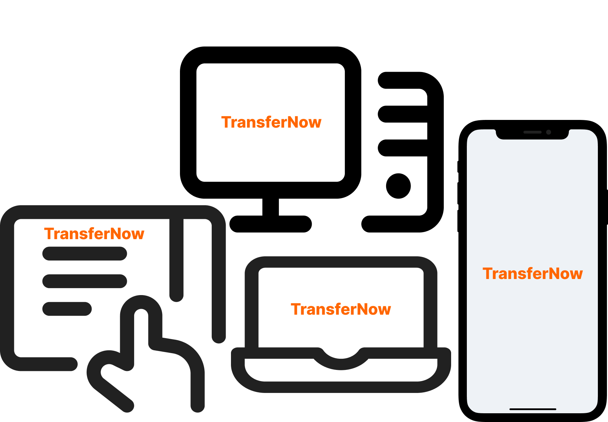
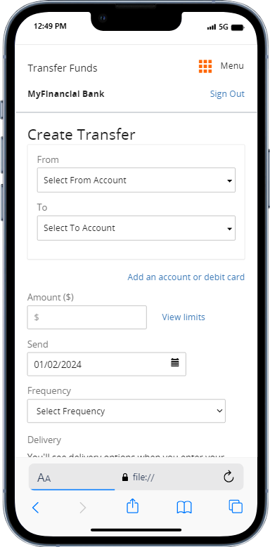
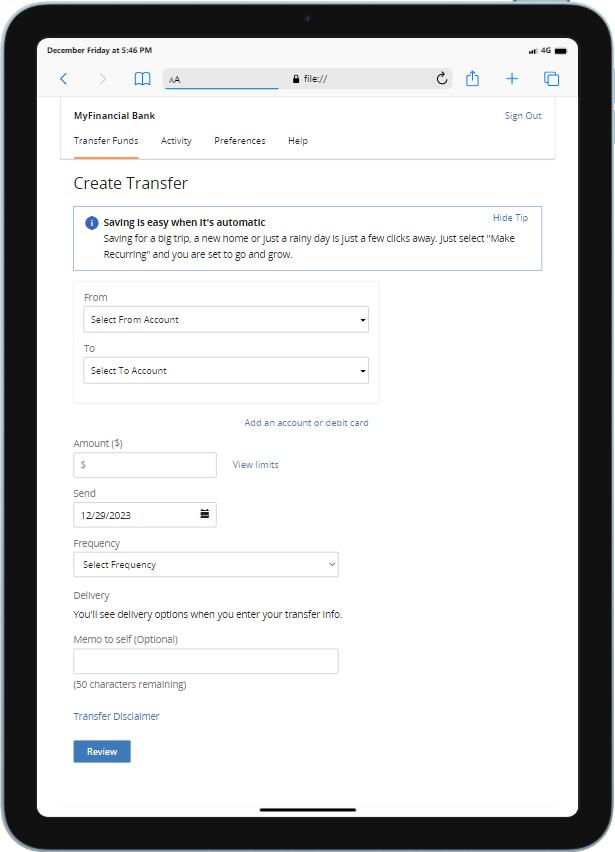
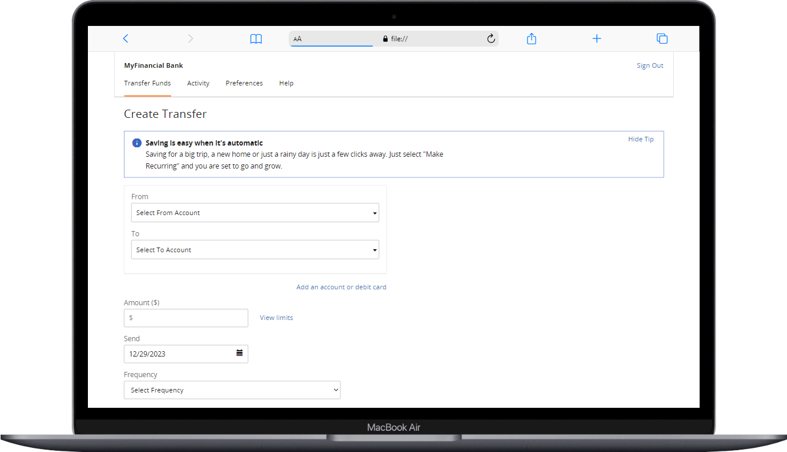

## Responsive Web Design

Responsive Web Design detects and adapts to the screen size of the user’s device, presenting a display format that best matches the device’s screen size. This is achieved in part through breakpoints (or breakpoint ranges)-sizes or size ranges, measured in pixels, that are specified as the points at which the display changes, depending on and adapting to the size of the device’s screen.

 &#128221 <i> <strong>Note:</strong> There are differences between the mobile-focused and desktop user interfaces. Most of the screenshot samples in this document are desktop-focused, unless otherwise specified. </i>
                                

    <input type="radio" name="slider" id="slide1" checked>
    <input type="radio" name="slider" id="slide2">
    <input type="radio" name="slider" id="slide3">
    

        

            

                

                    

                        

                        

                         
                        <ul><li>320*479 Pixel Breakpoint for Mobile Phones</li>
                        </ul>
                        

                        

                        
                    

                

                

                    

                        

                        

                        
                        <ul><li>480*767 Pixel Breakpoint For Plus-Sized Mobile Phones</li>
                        </ul>
                        

                        

                        
                    

                

                

                    

                        

                        

                        
                        <ul><li>700 Plus Pixel Breakpoint for Larger Screens</li>
                        </ul>
                        

                        

                        
                    

                

            

        

    

    

        <label for="slide1"></label>
        <label for="slide2"></label>
        <label for="slide3"></label>
    

    

        <label for="slide1"></label>
        <label for="slide2"></label>
        <label for="slide3"></label>
    

There is persistent navigation, located at the top or left-hand side of the screen for the breakpoint (768 plus pixels) optimized for larger screens (such as those used for desktops, laptops, and tablets) and this is a client-configurable option; and the content is generally left-aligned and wider. For the breakpoints at 480 and below, some functions are hidden, disabled or collapsed.

