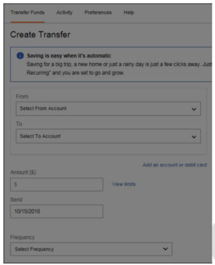
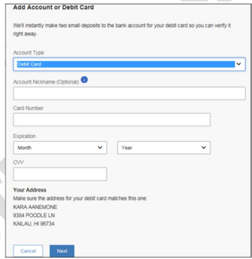

## Adding Debit Cards

In addition to adding an external ACH account, users can also add external debit cards. To do so, follow the steps below:

> In the “Transfer Funds” screen, click “Add an account or debit card”. Refer to Figure 11 as shown below.

  
ADD DEBIT CARDS

> “Add Account or Debit Card” screen is displayed  shown below

  
ADD ACCOUNT OR DEBIT CARD SCREEN

> Select “Debit Card” from the drop-down list under Account Type option.

<!-- theme: info -->

**Note**: Account Nickname is optional.

> Enter the Debit card number in “Card Number”.
> Select the debit card expiration month and year from the drop-down list under Expiration option.
> Add the CVV.

<!-- theme: info -->

**Note**: Your Address will be displayed by default using the address sent in the SSO, and is used for validation and the user will not be allowed to edit the address in TN. The user will have to change the address in the financial institution’s online banking.

> Click Next.
