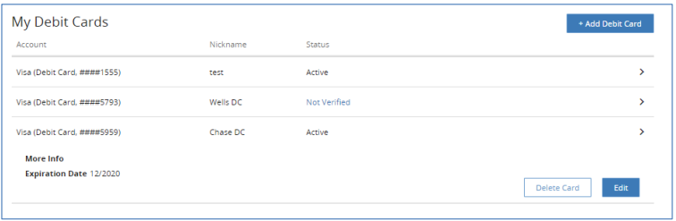

## Delete Debit Cards

    <ul>
    <li>To delete an existing debit card, go to the Preferences screen.</li>
    <li>Under <strong>My Debit Cards</strong> menu, user can see all the debit cards added.</li>
    
    <li>Select a debit card that the user wants to delete.</li>
    <li>Click the <button class="confirm-button">Delete Card</button> button to remove the debit card from the list.</li>
    <li>Delete Debit Card screen is displayed.</li>
    <li>Click the <button class="confirm-button">Yes, Delete</button> button to delete the selected debit card.</li>
    </ul>

