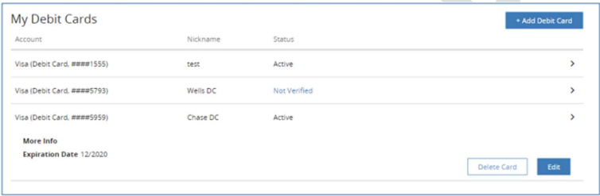
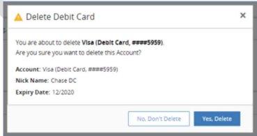

# Deleting Debit Cards 

&nbsp;
- Go to Preferences screen.
- Under “My Debit Cards” menu, user can see all the debit cards added.

&nbsp;

  
MY DEBIT CARDS SCREEN – TO DELETE

&nbsp;

- Select a debit card that the user wants to delete. 
- Click “Delete Card” to remove the debit card from the list. 
- Delete Debit Card screen is displayed. 
- Click Yes, Delete to delete the selected debit card. 

&nbsp;

  
DELETE DEBIT CARD

&nbsp;

## Documents References

[Adding Debit Cards](?path=docs/transfer-debit-card/adding-Acc.md)  
[Debit Card Verification](?path=docs/transfer-debit-card/debit-cardVerify.md)  
[Editing Debit Cards](?path=docs/transfer-debit-card/edit-debitCard.md)