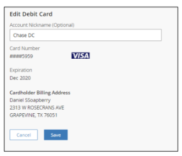

## Edit Debit Cards

    <ul>
    <li>Go to the Preferences screen.</li>
    <li>Under <strong>My Debit Cards</strong> menu, user can see all the debit cards added.</li>
    
    <li>Select a debit card that the user wants to edit.</li>
    <li>Click the <button class="confirm-button">Edit</button> button.</li>
    <li><strong>Edit Debit Card</strong> screen is displayed.</li>
    
    <li>The user can edit the Nickname on the debit card.</li>
    <li>Click the <button class="confirm-button">Save</button> button to view the edited information.</li>
    </ul>

Note: If the debit card is expired or a new one, the user can edit the expiry date if the new debit card number is same or if the debit card numbers are different, the user will have to delete and add as a new card.

