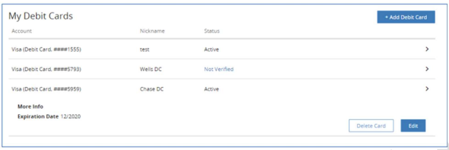
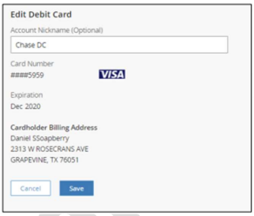

# Editing Debit Cards

- Go to Preferences screen.
- Under “My Debit Cards” menu, user can see all the debit cards added.

&nbsp;

  
MY DEBIT CARDS SCREEN – TO EDIT

&nbsp;

- Select a debit card that the user wants to edit. 
- Click “Edit".
- Edit Debit Card screen is displayed. 

&nbsp;

&nbsp;

  
EDIT DEBIT CARD

&nbsp;

A user can edit the following details in the debit cards added:

- Nickname of the debit card
- Expiry Date.

&nbsp;

<!-- theme: info -->

 **Note:** If the debit card is expired or a new one, the user can edit the expiry date if the new debit card number is same or if the debit card numbers are different, the user will have to delete and add as a new card.

&nbsp;

## Documents References

[Adding Debit Cards](?path=docs/transfer-debit-card/adding-Acc.md)  
[Debit Card Verification](?path=docs/transfer-debit-card/debit-cardVerify.md)  
[Deleting Debit Cards](?path=docs/transfer-debit-card/delete-debitCard.md)
