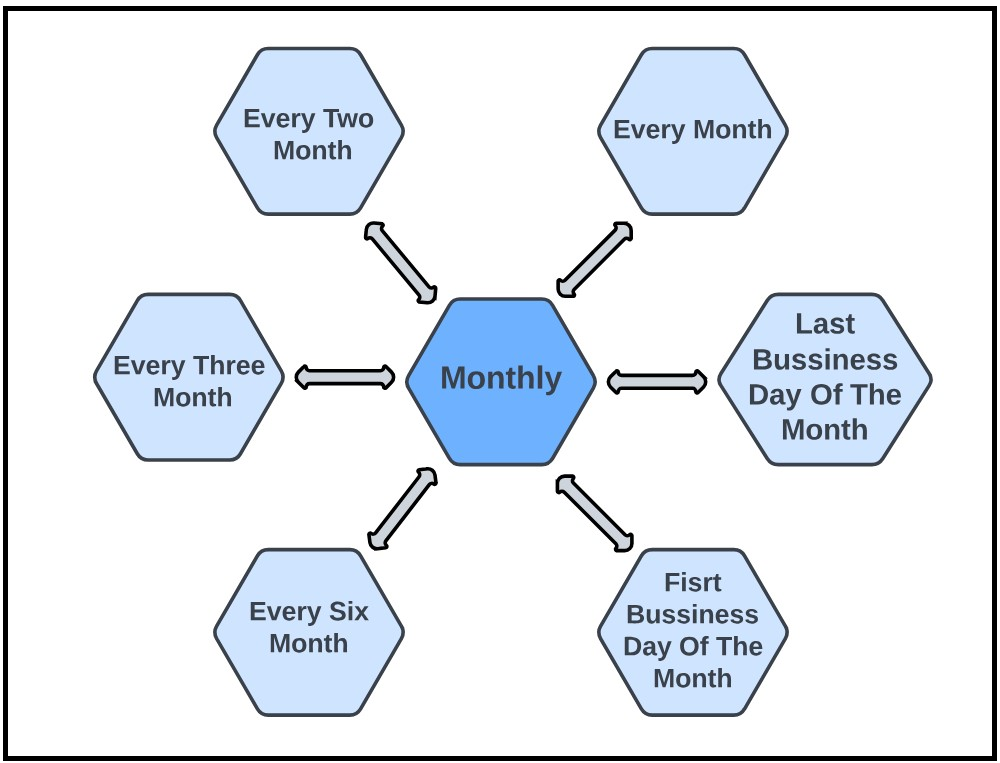
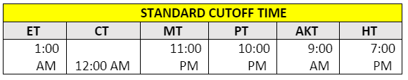

## Fund Transfer Frequencies/Duration

TransferNow supports the weekly and monthly frequencies.
&nbsp;

  

&nbsp;

  

&nbsp;

&nbsp;

  

## Transfer Cut-off times 
&nbsp;

For each client, Fiserv sets the appropriate time zone for the Standard cutoff time and for the Next-Day 
cutoff time (for those clients who offer Next-Day transfer service). Clients may alter the time zone 
settings via the DGF. 

&nbsp;

  

&nbsp;

<ul>
<li>An asterisk is displayed next to the Standard cutoff time. (i.e., 1 AM ET*) </li>
</ul>

&nbsp;

<!-- theme: info -->

 > :memo: **Note:** If a client has specified the ET time zone for display of the Standard cutoff time, TransferNow includes an asterisk and a footnote on the screen.

 &nbsp;
<!-- theme: info -->

 > :memo: **Note:** There are no cutoff times for Instant Transfers, as Instant Transfers will leverage the NOW network. ACH cutoff times and limitations do not apply to Instant Transfers.

&nbsp;

<style>
    .card-body ul {
        list-style: none;
        padding-left: 20px;
    }
    .card-body ul li::before {
        content: "\2022";
        font-size: 1em;
        color: #f60;
        display: inline-block;
        width: 1em;
        margin-left: -1em;
    }

