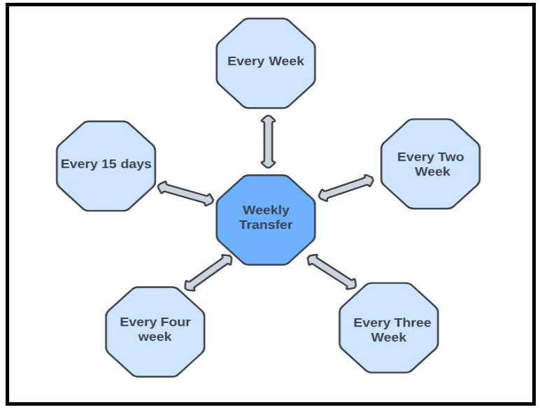

## Fund Transfer Frequencies/Duration

TransferNow supports the weekly and monthly frequencies.
&nbsp;

  

&nbsp;

 

&nbsp;

  

## Transfer Cut-off times 
&nbsp;

For each client, Fiserv sets the appropriate time zone for the Standard cutoff time and for the Next-Day 
cutoff time (for those clients who offer Next-Day transfer service). Clients may alter the time zone 
settings via the DGF. 

&nbsp;
        
        

            <table >
                    <tr>
                        <th colspan="6" style="background-color: orange;"><b>STANDARD CUTOFF TIME</b></th>
                    </tr>
                    <tr style="background-color: rgb(251, 214, 133);">
                        <th><b>ET</b></th>
                        <th><b>CT</b></th>
                        <th><b>MT</b></th>
                        <th><b>PT</b></th>
                        <th><b>AKT</b></th>
                        <th><b>HT</b></th>
                    </tr>
                    <tr>
                        <td>01:00 AM</td>
                        <td>12:00 AM</td>
                        <td>11:00 PM</td>
                        <td>10:00 PM</td>
                        <td>09:00 AM</td>
                        <td>07:00 PM</td>
                    </tr>
                <tbody>
                </tbody>
            </table>
        

&nbsp;

    <ul>
        <li> An asterisk is displayed next to the Standard cutoff time. (i.e., 1 AM ET*) </li>
    </ul>

 

&nbsp;

<!-- theme: info -->

 > :memo:_**Note:** If a client has specified the ET time zone for display of the Standard cutoff time, TransferNow includes an asterisk and a footnote on the screen._

 &nbsp;
<!-- theme: info -->

 > :memo:_**Note:** There are no cutoff times for Instant Transfers, as Instant Transfers will leverage the NOW network. ACH cutoff times and limitations do not apply to Instant Transfers._

&nbsp;

