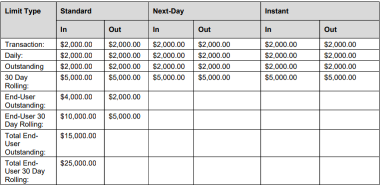
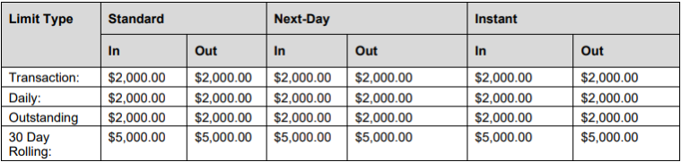

## Transfer Status / Limits

 
<ul>
<li><b>Pending</b> - A transfer is Pending from the time the user submits the transfer until the transfer is released to the ACH process.  </li>

<li><b>In-Process</b> - A transfer is In-Process from the time it is released to ACH until it is complete. If a transfer is returned, its status remains as In-Process while the transfer is resubmitted. </li>

<li><b>Complete</b> - A transfer is Complete when both the debit and credit legs of the transfer have been successfully processed. </li>

<li><b>Cancelled</b> - A transfer is Cancelled when the user requests to cancel the transfer or if the system cancels the transfer. </li>

<li><b>Failed</b> - A transfer is Failed when it fails.  </li>

<li><b>Rejected</b> - A transfer is Rejected if the transfer is returned or if a transfer is rejected through the Compass administrative module.  </li>

<li><b>Stopped</b> - A transfer is Stopped when it is cancelled through the Compass administrative module. </li>

<li><b>On-Hold</b> - A transfer is On Hold if, when the transfer was created, identity verification failed, or was not completed. </li>

</ul>

## Transfer Limits

Transfers are subject to a limit structure maintained to manage the risk associated with funds transfers. 

There is a default minimum transfer amount of $10.00. 

## Individual Limits

Limits are set for the account. The following types of limits are applicable: 

<ul>
<li>Time based (daily and 30 day rolling)  </li>

<li>Service Level (Standard, Next-Day, and Instant)  </li>

<li>Directional (inbound and outbound).  </li>

</ul>

  

## Debit Card Limits 

Debit card limits and services have different Individual account limits. 

  

## Transfer Fees

Fees can be a flat rate, a percent of transaction, or a combination of flat rate plus percent of transaction. Fees are always deducted from the source account. 

A user can avail a minimum number of free inbound transactions and free outbound transactions per calendar month. Free services are provided for each service, independently. 

<!-- theme: info -->

 > :memo: _**Note:** User will also have Free-to-Affiliate function enabled from certain financial institutions where no transaction fee is charged when using inbound or outbound transactions._ 

&nbsp;

