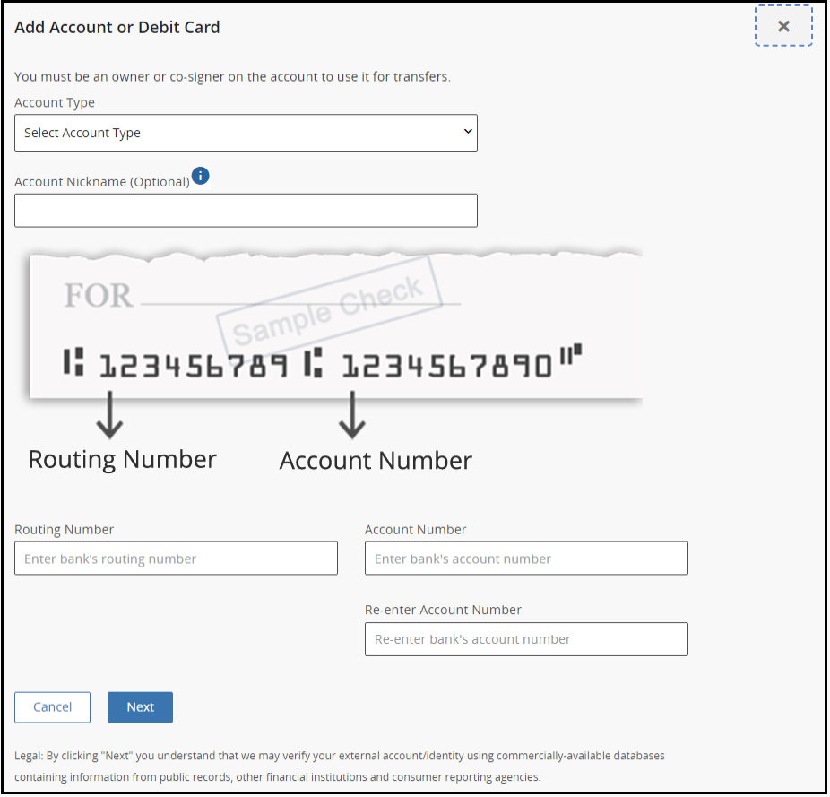
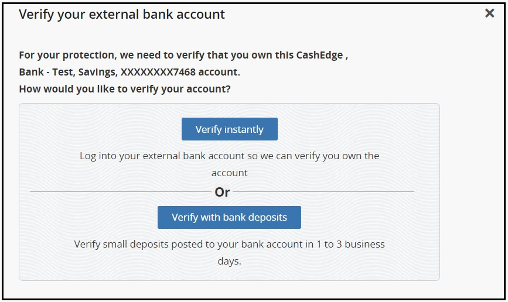
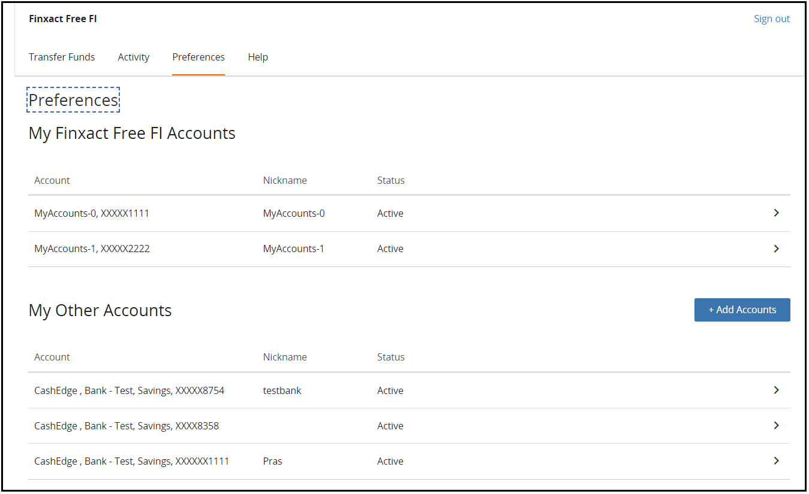

## Add an Account 

A TransferNow user may add a bank/credit union account or brokerage account as an account eligible for funds transfers.  

<ul>
<li>To add an external account, user can select Add a New Account option. </li>
</ul>

 

  

<ul>
<li>Add External Account screen is displayed. </li>
</ul>

 

  

    <ul>
        <li>
            The user adds one account at a time, specifying the account type, account number, and ABA routing number.
        </li>
        <li>
            Click Next.
        </li>
        <li>
            Verify your external bank account screen appears. See 
            <a href="../VerifyNow/?path=docs/verifynow-account-verification-method.md&branch=develop">
            VerifyNow - Account Verification Methods 
            </a> 
            for more information on the account verification. 
        </li>
    </ul>

 

  

The list of accounts added under any user can be viewed under the Preferences Screen. 

  

<!-- theme: info -->

> :memo: _**Note:** To know more about adding a brokerage accounts,_ see [Adding Brokerage Accounts](?path=docs/transfer-via-bank-accounts/add_brokerage.md)

     
    

        <a href="?path=docs/transfer-via-bank-accounts/transfer-via-bank-accounts.md">Back</a>
    

    

        <a href="?path=docs/transfer-via-bank-accounts/account_verification.md">Next</a>
    

