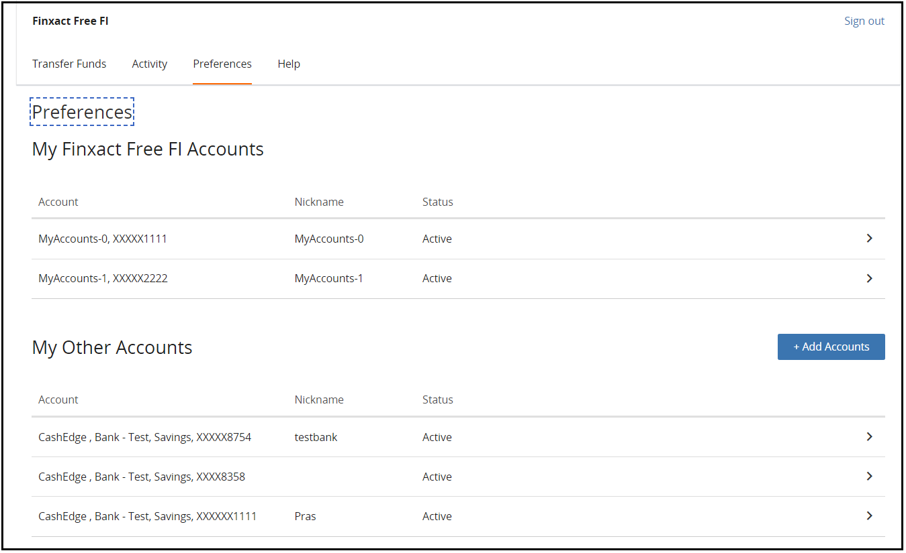

## Delete Accounts 

From the Preferences screen, the user can choose Delete Account. 

<ul>
<li>Select any account that you wanted to delete from the list.</li>
<li>Click “Delete Account”.</li>
<li>The Delete Account screen prompts the user to confirm that they want to delete the account.</li>
</ul>

 

&nbsp;

  

&nbsp;

  

<!-- theme: info -->

> :memo: _**Note:** Users can delete an account that is suspended; however, they cannot re-add the account until the suspension has been lifted._ 
> _Users can delete an account and re-add it. To prevent misuse of the trial deposit process, users can repeat this only once._

<!-- theme: info -->

> :memo: _**Note:** An account with a pending transfer cannot be deleted. The user can either wait until all pending transfers have completed or cancel all pending transfers that have not been released to ACH before attempting to delete the account again._ 

     
    

        <a href="?path=docs/transfer-via-bank-accounts.md">Back</a>
    

    

        <a href="?path=docs/transfer-via-bank-accounts/add_brokerage.md">Next</a>
    

