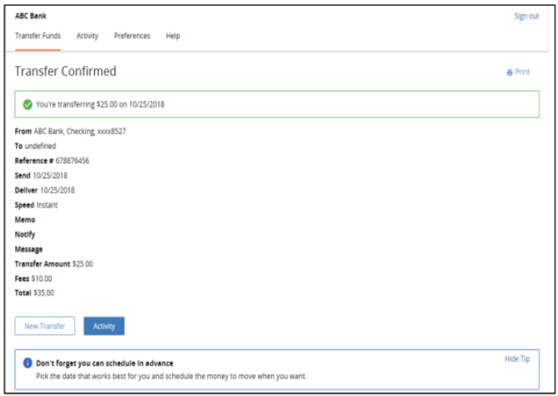
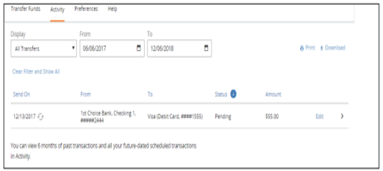

## Transfer Via Bank Accounts 

TransferNow provides the user with access to 23,000 banks, credit unions, and brokerages for which accounts can be added. The user searches for an institution and uses the appropriate data collection screens based on the services available for the selected institution. 

&nbsp;

  

<ul>
<li>User can select “From” and “To” account information from the list of accounts that are already added.</li>
<li>Enter the amount to be transferred.</li>
</ul>

<!-- theme: info -->

> :memo: _**Note:** View Limits will display the maximum amount that can be transferred._
User can select “From” and “To” account information from the list of accounts that are already added. 

<ul>
<li>Set the date when the user wants to initiate the transaction.</li>
<li>Select the Frequency. To know more about Transfer Funds Frequency, see XXX.</li>
<li>Click Review.</li>
</ul>

&nbsp;

  

<ul>
<li>The transfer detail is displayed on the screen to allow the user to review and confirm. </li>
<li>lick confirm to complete the transfer.</li>
<li>Transfer confirmation screen is displayed.</li>
</ul>

&nbsp;

  

<ul>
<li>All transfers, including debit card transfers are shown on the “Activity” page as shown below. </li>
</ul>

 

&nbsp;

  

Following topics cover additional information that allows a user to manage and transfer money from one account to another. 

[Add An Account](?path=docs/transfer-via-bank-accounts/add-an-Account.md)   
[Account Verification](?path=docs/transfer-via-bank-accounts/account_verification.md)      
[Add Brokerage Accounts ](?path=docs/transfer-via-bank-accounts/add_brokerage.md)   
[Delete Accounts ](?path=docs/transfer-via-bank-accounts/delete_accounts.md)   

## See Also

[Account Restrictions]((?path=docs/transfer-via-bank-accounts/accounts-restrictions.md))

